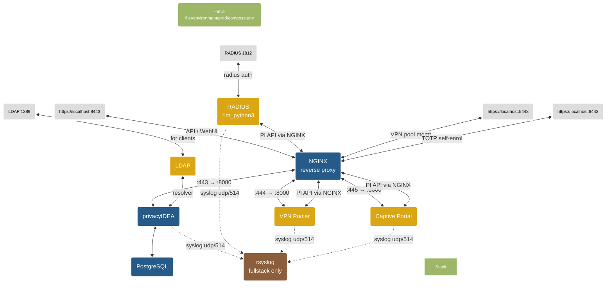

🌐 **English** | [Русский](README.ru.md)

# privacyIDEA-docker

Simply deploy and run an MFA instance in a container environment powered and based on privacyIDEA.

## Overview 
[privacyIDEA](https://github.com/privacyidea/privacyidea) is an open solution for strong two-factor authentication like OTP tokens, SMS, smartphones or SSH keys. 

This project is a complete build environment under linux to build and run an MFA system in a container environment. It uses the [Wolfi OS](https://github.com/wolfi-dev) image and a fork of the [privacyIDEA-Project](https://github.com/privacyidea/privacyidea/). The image uses [gunicorn](https://gunicorn.org/) from PyPi to run the app. 

### tl;dr 
See [requirements](#prerequisites-and-requirements)

Clone repository and start a full privacyIDEA stack*: 
```
git clone --recurse-submodules https://github.com/ilya-maltsev/privacyidea-docker.git
cd privacyidea-docker
make cert build-all fullstack
```
Username / password: admin / admin

---

> [!Important] 
> The image does **not include** a reverse proxy or a database backend. Running the default image as a standalone container uses gunicorn and a sqlite database. Using sqlite is not suitable for a production environment.
>
> A more 'real-world' scenario, which is often used, is described in the [Compose a privacyIDEA stack](#compose-a-privacyidea-stack) section.
>
> Also check the [Security considerations](#security-considerations) before running the image or stack in a production environment.

**While decoupling the privacyIDEA image from dependencies like Nginx, Apache or database vendors ect., it is possible to run privacyIDEA with your favorite components.**

## Repository 

| Directory | Description |
|-----------|-------------|
| *conf* | contains *pi.cfg* and *logging.cfg* files which is included in the image build process.|
| *environment* | per-service environment files organized by stack (`environment/prod/`, `environment/dev/`). Each service has its own `.env` file; `compose.env` carries compose-level variables (ports, TLS paths).|
| *scripts* | contains custom scripts for the privacyIDEA script-handler. The directory will be mounted into the container when composing a [stack](#compose-a-privacyidea-stack). Scripts must be executable (chmod +x)|
| *templates*| contains files used for different services (nginx, radius ...), the self-signed dev SSL certificate (`pi.pem` / `pi.key`), and the systemd service template. For production TLS, set `NGINX_TLS_CERT_PATH` / `NGINX_TLS_KEY_PATH` in your env file to point at your real cert/key (PEM without passphrase; `.pfx` not supported). |
| *templates/rsyslog*| Dockerfile and config for the rsyslog log-collector container (fullstack profile only).|
| *rlm_python3*| git submodule — [FreeRADIUS rlm_python3 plugin](https://github.com/ilya-maltsev/rlm_python3) for privacyIDEA authentication. Replaces the legacy Perl-based rlm_perl plugin.|
| *pi-vpn-pooler*| git submodule — [VPN IP pool manager](https://github.com/ilya-maltsev/pi-vpn-pooler) that integrates with privacyIDEA API.|
| *pi-custom-captive*| git submodule — [custom captive portal](https://github.com/ilya-maltsev/pi-custom-captive) for self-service TOTP (Google Authenticator) enrollment with narrow admin token management. One-shot: a user can enroll exactly once and is then locked out until an administrator deletes/unassigns the token.|

## Submodules

This project uses git submodules for the FreeRADIUS plugin, VPN Pooler service, and Captive Portal. When cloning, use `--recurse-submodules`:

```
git clone --recurse-submodules https://github.com/ilya-maltsev/privacyidea-docker.git
```

If you already cloned without submodules, initialize them:

```
git submodule update --init --recursive
```

## Quickstart

### Prerequisites and requirements

- Installed a container runtime engine (docker / podman).
- Installed [BuildKit](https://docs.docker.com/build/buildkit/), [buildx](https://github.com/docker/buildx) and [Compose V2](https://docs.docker.com/compose/install/linux/) (docker-compose-v2) components
- The repository is tested with versions listed in [COMPAT.md](COMPAT.md)


#### Quick & Dirty

Build and run a simple local privacyIDEA container (standalone with sqlite):

```
git clone --recurse-submodules https://github.com/ilya-maltsev/privacyidea-docker.git
cd privacyidea-docker
make cert build run
```

Web-UI: http://localhost:8080

User/password: **admin**/**admin**

## Build images

All application images are built locally — no prebuilt cloud images are used.

### Build all images at once

Use `build-images.sh` to build all application images and pull infrastructure images:

```
bash build-images.sh build
```

Or use the Makefile target:

```
make build-all
```

The script automatically initializes git submodules before building.

### Build, export and import

For offline environments or transferring images between machines. The archive includes the full repository (Makefile, compose files, environment templates, configs) and all Docker images in a single `.tar.gz`:

```
bash build-images.sh all       # build + export to privacyidea-images.tar.gz
bash build-images.sh export    # export only (images must exist)
bash build-images.sh import    # import from docker-images.tar (extract archive first)
```

You can operate on specific images by passing short names after the command:

```
bash build-images.sh build captive pooler    # build only captive + vpn_pooler
bash build-images.sh export pi radius        # export selected images + repo
bash build-images.sh all captive             # build + export captive only
bash build-images.sh help                    # show available short names
```

Short names: `privacyidea` (`pi`), `freeradius` (`radius`), `pooler` (`vpn_pooler`), `captive`, `postgres`, `nginx`, `openldap` (`ldap`).

### Build a specific privacyIDEA version
```
make build PI_VERSION=3.13 PI_VERSION_BUILD=3.13
```

### Images built by this project

| Image | Source | Description |
|-------|--------|-------------|
| `privacyidea-docker:3.13` | `./Dockerfile` | privacyIDEA application |
| `privacyidea-freeradius:latest` | `./rlm_python3/` (submodule) | FreeRADIUS with rlm_python3 plugin |
| `pi-vpn-pooler:latest` | `./pi-vpn-pooler/` (submodule) | VPN IP pool manager |
| `pi-custom-captive:latest` | `./pi-custom-captive/` (submodule) | Self-service TOTP captive portal |
| `privacyidea-rsyslog:latest` | `./templates/rsyslog/` | Centralized rsyslog collector (fullstack only) |

### Infrastructure images (pulled from registry)

| Image | Used by |
|-------|---------|
| `postgres:16-alpine` | Database for privacyIDEA |
| `nginx:stable-alpine` | Reverse proxy |
| `osixia/openldap:latest` | LDAP directory (optional, for testing) |

#### Push to a registry
Use ```make push [REGISTRY=<registry>]```to tag and push the image[^1]
##### Example 
Push image to local registry on port 5000[^2]

```
make push REGISTRY=localhost:5000
``` 

#### Remove the container:
```
make clean
```
You can start the container with the same database (sqlite) and configuration and use ```make run``` again without bootstrapping the instance.
#### Remove the container including data:
```
make distclean
```
&#9432; This will remove all containers **and** the `data/` directories (database, persistent config, etc.)!

## Overview ```make``` targets

| target | optional ARGS | description | example
---------|----------|---|---------
| ```build ``` | ```PI_VERSION```<br> ```IMAGE_NAME```|Build the privacyIDEA image. Optional: specify the version and image name| ```make build PI_VERSION=3.13 PI_VERSION_BUILD=3.13```|
| ```build-all``` | |Build all images (privacyIDEA, FreeRADIUS, VPN Pooler, Captive Portal, rsyslog) and pull infrastructure images| ```make build-all```|
| ```push``` | ```REGISTRY```|Tag and push the image to the registry. Optional: specify the registry URI. Defaults to *localhost:5000*| ```make push REGISTRY=docker.io/your-registry/privacyidea-docker```|
| ```run``` |  ```PORT``` <br> ```TAG```  |Run a standalone container with gunicorn and sqlite. Optional: specify the prefix tag of the container name and listen port. Defaults to *pi* and port *8080*| ```make run TAG=prod PORT=8888```|
| ```secrets``` | ```TAG``` | Generate and write random secrets into the per-service env files under `environment/{TAG}/`. Covers `PI_SECRET`, `PI_PEPPER`, `PI_ADMIN_PASS`, `PI_ENCKEY`, `DB_PASSWORD` (synced between `db.env` and `privacyidea.env`), and Django secret keys for VPN Pooler and Captive Portal. | ```make secrets```, ```make secrets TAG=dev```|
| ```cert``` | |Generate a self-signed certificate for the reverse proxy container in *./templates* and **overwrite** the existing one | ```make cert```|
| ```stack``` |```TAG``` ```PROFILE```| Run a production stack (db, privacyidea, reverse_proxy, freeradius, vpn_pooler, captive). Default profile is *stack*. | ```make stack```, ```make stack TAG=dev PROFILE=fullstack```|
| ```fullstack``` || Run a full dev/test stack (all stack services + LDAP + rsyslog) | ```make fullstack```
| ```superadmin-policy``` | ```TAG``` | Import the superadmin policy (`templates/superadmin-policy.json`) into a running privacyIDEA instance. Includes admin API permissions, WebUI dashboard, and user self-service policy for captive portal TOTP enrollment. | ```make superadmin-policy```, ```make superadmin-policy TAG=dev```|
| ```resolver``` || Create resolvers and realm for fullstack | ```make resolver```
| ```install-service``` |```SERVICE_USER``` ```SERVICE_WORKDIR```| Create service user (if needed), add to docker group, set directory ownership, install and enable systemd service. Defaults to user `privacyidea` and current directory. | ```make install-service```, ```make install-service SERVICE_USER=privacyidea SERVICE_WORKDIR=/opt/privacyidea-docker```|
| ```uninstall-service``` || Stop, disable and remove the systemd service | ```make uninstall-service```|
| ```clean``` |```TAG```| Remove the container and network without removing the named volumes. Optional: change prefix tag of the container name. Defaults to *prod* | ```make clean TAG=prod```|
| ```distclean``` |```TAG```| Remove containers, networks, **named volumes** (dev) **and data directories** (prod). Defaults to *prod* | ```make distclean TAG=prod```|

> [!Important] 
> Using the image as a standalone container is not production ready. For a more like 'production ready' instance, please read the next section.

## Compose a privacyIDEA stack

By using docker compose you can easily deploy a customized privacyIDEA instance, including Nginx as a reverse-proxy and PostgreSQL as a database backend.

With the use of different environment files for different full-stacks, you can deploy and run multiple stacks at the same time on different ports. 



Environment files are organized per service under `environment/prod/` and `environment/dev/`. Each service has its own `.env` file; `compose.env` carries compose-level variables (ports, TLS paths). See [Environment Variables](#environment-variables) for details.

### Profiles

| Profile | Services | Use case |
|---------|----------|----------|
| `stack` | db, privacyidea, reverse_proxy, freeradius, vpn_pooler, captive | **Production** — full working set without LDAP |
| `fullstack` | all `stack` services + openldap, rsyslog | **Dev/testing** — includes LDAP with sample data and centralized log collection |
| `ldap` | openldap | LDAP directory only (add to other profiles) |

> [!Note]
> **Dev-only resolver seed.** `environment/dev/privacyidea.env` sets `PI_SEED_RESOLVERS=true`, which tells `entrypoint.py` to run `pi-manage config import -i /privacyidea/etc/persistent/resolver.json` on first boot. The seed is idempotent (gated on a `resolver_imported` flag file) and is **not** enabled in the prod env — prod stacks start with an empty privacyIDEA configuration. Use `make superadmin-policy` to import the initial admin policies on prod.

> [!Note]
> **Dev-only rsyslog collector.** The `fullstack` profile includes an `rsyslog` container that receives syslog messages (UDP 514) from privacyIDEA, FreeRADIUS, VPN Pooler and Captive Portal on the internal Docker network. Logs are written to per-service files inside the `rsyslog_logs` volume (`privacyidea.log`, `privacyidea-radius.log`, `pi-vpn-pooler.log`, `pi-custom-captive.log`, `all.log`). `application-dev.env` pre-configures all four services to forward to this collector. The `stack` (production) profile does **not** include rsyslog — configure your own external rsyslog host via the `*_SYSLOG_HOST` variables instead.

### Exposed ports (stack profile)

| Service | Host port | Protocol | Description |
|---------|-----------|----------|-------------|
| db (PostgreSQL) | `${DB_PORT:-5432}` | tcp | Database |
| privacyidea | `${PI_PORT:-8080}` | tcp | Direct gunicorn (use reverse_proxy for production) |
| reverse_proxy (privacyIDEA) | `${PROXY_PORT:-8443}` | tcp (HTTPS) | NGINX SSL termination → privacyIDEA :8080 |
| reverse_proxy (VPN Pooler) | `${VPN_POOLER_PORT:-5443}` | tcp (HTTPS) | NGINX SSL termination → VPN Pooler :8000 |
| reverse_proxy (Captive Portal) | `${CAPTIVE_PORT:-6443}` | tcp (HTTPS) | NGINX SSL termination → Captive Portal :8000 |
| freeradius | `${RADIUS_PORT:-1812}` | tcp + udp | RADIUS authentication |
| freeradius | `${RADIUS_PORT_INC:-1813}` | udp | RADIUS accounting |

> [!Note]
> privacyIDEA, VPN Pooler and Captive Portal are plain HTTP services behind the NGINX reverse proxy which terminates TLS. The `vpn_pooler` and `captive` containers only expose port 8000 internally and are **not** published to the host — all external access goes through `reverse_proxy` on `${VPN_POOLER_PORT}` / `${CAPTIVE_PORT}`.

- The openldap container is only available with `fullstack` or `ldap` profiles (dev/testing only).
- The rsyslog container is only available with the `fullstack` profile (dev/testing only). It does not expose any ports to the host.
- The radius container is built locally from the [rlm_python3](https://github.com/ilya-maltsev/rlm_python3) submodule.
- The VPN Pooler is built locally from the [pi-vpn-pooler](https://github.com/ilya-maltsev/pi-vpn-pooler) submodule.
- The Captive Portal is built locally from the [pi-custom-captive](https://github.com/ilya-maltsev/pi-custom-captive) submodule.
- The openldap uses the [osixia/docker-openldap](https://github.com/osixia/docker-openldap) image.

---
### Examples:

Build all images and run a full dev stack (self-signed cert):

```
make cert build-all fullstack
```

Run a production stack with your own TLS certificates (set paths in `application-prod.env`):

```
make build-all stack
```

> [!Note]
> In production, `make cert` is **not needed** — set `NGINX_TLS_CERT_PATH` and `NGINX_TLS_KEY_PATH` in your environment file to point at your existing certificate and key. Only use `make cert` for dev/testing with a self-signed pair.

Run a stack with project the name *prod* and environment variables files from *environment/prod/compose.env*

```
  $ TAG=prod docker compose --env-file=environment/prod/compose.env -p prod --profile=stack up -d
```
Or simple run a ```make``` target.

This example will start a production stack including **PostgreSQL**, **privacyIDEA**, **reverse_proxy**, **FreeRADIUS**, **VPN Pooler** and **Captive Portal**:
```
make stack
```

This example will start a full stack (dev) including all production services **plus OpenLDAP** with sample data, users and realms, and a centralized **rsyslog** collector. Project tag is *prod*:

```
make cert fullstack 
```

> [!Note]
> The ldap have sample users. The resolvers and realm are already configured in privacyIDEA when stack is ready.

### Dev credentials (fullstack)

The `fullstack` profile seeds OpenLDAP with sample users from `templates/sample.ldif`. Password is always the **givenName in lowercase**.

**Built-in privacyIDEA DB admin** (created by `entrypoint.py`, not LDAP):

| Login | Password |
|-------|----------|
| admin | admin |

**LDAP system accounts:**

| uid | Password | employeeType | Realm |
|-----|----------|--------------|-------|
| `admin` | `admin` | admin | admin |
| `helpdesk` | `helpdesk` | helpdesk | helpdesk |

**LDAP sample users** (employeeType=user, realm `exampleorg`):

| uid | Password | uid | Password |
|-----|----------|-----|----------|
| AdaStu | ada | HarpMon | harpal |
| LatrStr | latrena | HindBel | hinda |
| OlivDon | olive | FaunCho | faun |
| ShirUng | shir | DesHem | des |
| ZiaBre | zia | AdelLie | adelina |
| YoniHes | yonik | KaraVer | kara |
| MeliPur | melicent | LorrDon | lorrin |
| EnidMcS | enid | DoroGru | dorothy |
| LyseLun | lyse | MandMic | mandana |
| LureRee | lurette | NealMcS | neal |
| PearKel | pearline | EsmaWes | esma |

**LDAP helpdesk accounts** (realm `helpdesk`): ChauMee / chau, MarlLab / marleen, ThanCha / thane, SuziBel / suzi, EricMcL / erick, UlriTho / ulrikaumeko, MarlFel / marleen, AnnaKri / annadiane, RheaPer / rhea

**LDAP admin accounts** (realm `admin`): admin / admin, MariUng / marissa, BertSuz / berthe, FaytPac / fayth

> [!Note]
> The OpenLDAP admin bind account is `cn=admin,dc=example,dc=org` with password `openldap`.

Shutdown the stack with the project name *prod* and **remove** all resources (container,networks, etc.) except the volumes.

```
docker compose -p prod down 
```

You can start the stack in the background with console detached using the **-d** parameter.

```
  $ TAG=prod docker compose --env-file=environment/prod/compose.env -p prod --profile=stack up -d
```

Full example including build with  ```make```targets:
```
make cert build-all stack PI_VERSION=3.13 PI_VERSION_BUILD=3.13 TAG=pidev
```

### Dev mode with hot-reload (subprojects)

`docker-compose.dev.yaml` is an override file that bind-mounts the **rlm_python3**, **pi-vpn-pooler** and **pi-custom-captive** source code into the running containers. This lets you edit Python files locally and see changes applied without rebuilding images.

| Service | What is mounted | Hot-reload |
|---------|----------------|------------|
| **vpn_pooler** | `./pi-vpn-pooler` → `/app` | Yes — gunicorn `--reload` restarts workers automatically on file changes |
| **captive** | `./pi-custom-captive` → `/app` | Yes — gunicorn `--reload` restarts workers automatically on file changes |
| **freeradius** | `./rlm_python3/privacyidea_radius.py` → plugin path | No — FreeRADIUS loads the Python module once at startup. Container restart required: `docker compose restart freeradius` |

Usage:

```
TAG=dev docker compose --env-file environment/dev/compose.env \
  -f docker-compose.yaml -f docker-compose.dev.yaml \
  --profile fullstack up --build
```

> [!Note]
> The override reduces vpn_pooler and captive to a single gunicorn worker with `--reload` enabled. This is intended for development only — do not use `docker-compose.dev.yaml` in production.

---
Now you can deploy additional containers like OpenLDAP for user realms or Owncloud as a client to test 2FA authentication. 

Have fun!

> [!IMPORTANT] 
>- **Dev** uses Docker named volumes (managed by Docker). **Prod** uses host directories under `data/`. Neither is deleted by `make clean` or `docker compose down` — use `make distclean` to remove both.
>- Delete the files in `data/pidata/` (prod) or the `pidata` volume (dev) if you want to bootstrap again. This will not delete an existing database except sqlite databases!
>- Compose a stack takes some time until the database tables are deployed and privacyIDEA is ready to run. Check health status of the container.


## Database

This project uses **PostgreSQL 16** as the database backend for privacyIDEA.

| Database | User | Used by |
|----------|------|---------|
| `pi` | `pi` | privacyIDEA |

> [!Note]
> The **VPN Pooler** and **Captive Portal** are both **stateless** — they have no local database. VPN Pooler stores pool definitions in a YAML file (`/app/data/pools.yaml`) mounted from `data/vpn_pooler_data/` and reads allocations live from privacyIDEA user attributes on every request. The Captive Portal is fully stateless. Both emit actions as syslog events (see [Syslog and DEBUG logging](#syslog-and-debug-logging)).

> [!Note]
> privacyIDEA uses `psycopg2` as the PostgreSQL adapter. Since privacyIDEA 3.3, the PostgreSQL adapter is not included in the default installation (see [privacyIDEA FAQ](https://privacyidea.readthedocs.io/en/stable/faq/mysqldb.html)). This project installs `psycopg2-binary` explicitly in the Dockerfile.


## Environment Variables

### Per-service env files

Environment is organized into per-service files under `environment/{prod,dev}/`:

```
environment/prod/
├── compose.env        # compose-level: ports, TLS paths (passed via --env-file)
├── db.env             # PostgreSQL: POSTGRES_DB, POSTGRES_USER, POSTGRES_PASSWORD
├── privacyidea.env    # privacyIDEA: PI_*, DB_*, syslog
├── freeradius.env     # FreeRADIUS: RADIUS_* vars
├── vpn_pooler.env     # VPN Pooler: Django, syslog (unprefixed names)
├── captive.env        # Captive Portal: Django, mTLS, syslog (unprefixed names)
```

Each service's `env_file` is set in `docker-compose.yaml` using `environment/${TAG:-prod}/<service>.env`. The `TAG` variable selects the environment directory (`prod` or `dev`).

> [!Note]
> Variables in per-service files use the **actual names** the application expects (e.g. `DJANGO_SECRET_KEY`, not `VPN_POOLER_DJANGO_SECRET_KEY`). The old prefix-stripping logic has been removed from `docker-compose.yaml`.

### Data storage

**Prod** (`docker-compose.yaml`): persistent data is stored in host directories under `./data/` — visible, easy to back up, owned by the service user.

**Dev** (`docker-compose.dev.yaml` override): persistent data uses Docker named volumes — no setup needed.

| Directory / Volume | Contents |
|--------------------|----------|
| `data/pgdata` / `pgdata` | PostgreSQL database files |
| `data/pidata` / `pidata` | privacyIDEA persistent config (enckey, etc.) |
| `data/vpn_pooler_static` / `vpn_pooler_static` | VPN Pooler collected static files |
| `data/vpn_pooler_data` / `vpn_pooler_data` | VPN Pooler pool definitions (`pools.yaml`) |
| `data/captive_static` / `captive_static` | Captive Portal collected static files |
| `data/rsyslog_logs` / `rsyslog_logs` | rsyslog log files (fullstack only) |

> [!Note]
> `docker-compose.yaml` uses `./data/*` bind mounts and has no `volumes:` section. The dev override (`docker-compose.dev.yaml`) declares named volumes and overrides the mounts. `make fullstack` loads the override automatically; `make stack` uses the base file only.

### privacyIDEA (`privacyidea.env`)
| Variable | Default | Description
|-----|---------|-------------
```PI_VERSION```|latest| Set the used image version
```PI_ADMIN```|admin| login name of the initial administrator
```PI_ADMIN_PASS```|admin| password for the initial administrator
```PI_PASSWORD```|admin| Password for the admin user. See [Security considerations](#security-considerations) for more information.
```PI_PEPPER``` | changeMe | Used for ```PI_PEPPER``` in pi.cfg. The filename, including the path, to the file **inside** the container, with the secret. Use `make secrets` to generate new random secrets to use with an environment file See [Security considerations](#security-considerations) for more information.
```PI_SECRET``` | changeMe | Used for ```SECRET_KEY``` in pi.cfg. Use `make secrets` to generate new random secrets to use with an environment file. See [Security considerations](#security-considerations) for more information.
```PI_ENCKEY```|| The enckey file for DB-encryption (base64). Only used if exists. Otherwise it will be generated using the ```pi-manage``` command. See [privacy documentation](https://privacyidea.readthedocs.io/en/latest/faq/crypto-considerations.html?highlight=enckey) how to create a key.
```PI_PORT```|8080| Port used by gunicorn. Don't use this directly in productive environments. Use a reverse proxy.
```PI_LOGLEVEL```|INFO| Log level in uppercase (DEBUG, INFO, WARNING, ect.). 
```SUPERUSER_REALM```|"admin,helpdesk"| Admin realms, which can be used for policies in privacyIDEA. Comma separated list. See the privacyIDEA documentation for more information.
```PI_SQLALCHEMY_ENGINE_OPTIONS```| False | Set pool_pre_ping option. Set to ```True``` for DB clusters.
```PI_SEED_RESOLVERS```| *(unset)* | Dev-only one-shot seed. When set to `true`, `entrypoint.py` runs `pi-manage config import -i /privacyidea/etc/persistent/resolver.json` on first boot and writes a `resolver_imported` flag file so re-runs don't re-import or overwrite admin tweaks. Set only in `environment/dev/privacyidea.env`; leave unset in prod.
```PI_SYSLOG_ENABLED```| false | Enable remote syslog forwarding from the privacyIDEA application. When `false`, logs only go to stdout / container logs.
```PI_SYSLOG_HOST```| *(empty)* | Remote rsyslog host. Required when `PI_SYSLOG_ENABLED=true`.
```PI_SYSLOG_PORT```| 514 | Remote rsyslog port.
```PI_SYSLOG_PROTO```| udp | Transport for remote rsyslog: `udp` or `tcp`.
```PI_SYSLOG_FACILITY```| local1 | Syslog facility.
```PI_SYSLOG_TAG```| privacyidea | Syslog program name / ident.
```PI_SYSLOG_LEVEL```| INFO | Minimum level forwarded: `DEBUG`, `INFO`, `WARNING`, `ERROR`, `CRITICAL`.

**Additional environment variables** starting with ```PI_``` will automatically added to ```pi.cfg```

### DB connection parameters (`db.env` + `privacyidea.env`)
| Variable | Default | Description
|-----|---------|-------------
```DB_HOST```| db | Database host
```DB_PORT```| 5432 | Database port
```DB_NAME```| pi | Database name
```DB_USER```| pi | Database user
```DB_PASSWORD```| superSecret | The database password.
```DB_API```| postgresql+psycopg2 | Database driver for SQLAlchemy

### Reverse proxy parameters (`compose.env`)

The nginx `reverse_proxy` terminates TLS for privacyIDEA (host `${PROXY_PORT}` → container `:443`), VPN Pooler (host `${VPN_POOLER_PORT}` → container `:444`) and Captive Portal (host `${CAPTIVE_PORT}` → container `:445`), using the same certificate pair. The `vpn_pooler` and `captive` containers speak plain HTTP on `:8000` inside the compose network and are not published to the host.

| Variable | Default | Description
|-----|---------|-------------
```PROXY_PORT```| 8443 | Exposed HTTPS port for privacyIDEA.
```PROXY_SERVERNAME```| localhost | Set the reverse-proxy server name. Should be the common name used in the certificate.
```NGINX_TLS_CERT_PATH```| ./templates/pi.pem | **Host-side** path to the TLS certificate file. This path is bind-mounted into the container. Leave empty to use the dev self-signed cert at `./templates/pi.pem`. In prod, set to the absolute path of your real certificate (e.g. `/etc/ssl/private/privacyidea.pem`).
```NGINX_TLS_KEY_PATH```| ./templates/pi.key | **Host-side** path to the TLS private key file. Same mechanism as `NGINX_TLS_CERT_PATH`. In prod, set to the absolute path of your real key (e.g. `/etc/ssl/private/privacyidea.key`).

### RADIUS parameters (`freeradius.env`)
| Variable | Default | Description
|-----|---------|-------------
```RADIUS_PORT```| 1812 | Exposed (external) radius port tcp/udp
```RADIUS_PORT_INC```| 1813 | Additional exposed (external) radius port udp
```RADIUS_PI_REALM```| | privacyIDEA realm for RADIUS authentication
```RADIUS_PI_RESCONF```| | privacyIDEA resolver configuration for RADIUS
```RADIUS_PI_SSLCHECK```| false | Enable SSL certificate verification for privacyIDEA API
```RADIUS_DEBUG```| false | Enable DEBUG-level logging in the rlm_python3 plugin. When `true`, dumps the full incoming RADIUS request, URL params, HTTP request/response packets to privacyIDEA, and the outgoing RADIUS reply. See [Syslog and DEBUG logging](#syslog-and-debug-logging).
```RADIUS_PI_TIMEOUT```| 10 | Timeout (seconds) for privacyIDEA API requests
```RADIUS_SYSLOG```| true | Enable syslog output from the rlm_python3 plugin (in addition to `radiusd.radlog`). When `false`, logs only go to the FreeRADIUS log.
```RADIUS_SYSLOG_HOST```| *(empty)* | Remote rsyslog host. Empty uses the local syslogd inside the container.
```RADIUS_SYSLOG_PORT```| 514 | Remote rsyslog port.
```RADIUS_SYSLOG_PROTO```| udp | Transport for remote rsyslog: `udp` or `tcp`.
```RADIUS_SYSLOG_FACILITY```| auth | Syslog facility: `auth`, `authpriv`, `daemon`, `local0`..`local7`.
```RADIUS_SYSLOG_TAG```| privacyidea-radius | Syslog program name / ident.
```RADIUS_SYSLOG_LEVEL```| INFO | Minimum level forwarded to syslog: `DEBUG`, `INFO`, `WARNING`, `ERROR`, `CRITICAL`. Must be `DEBUG` to see full-packet dumps from `RADIUS_DEBUG=true`.

### VPN Pooler parameters (`vpn_pooler.env`)

The VPN Pooler is **stateless** — no database. Pool definitions are stored in a YAML file on a Docker volume (`/app/data/pools.yaml`). Allocations are read live from privacyIDEA user attributes on every request. Login supports optional 2FA: users with an active TOTP token in privacyIDEA are prompted for a one-time code after password authentication; users without TOTP skip the OTP step.

| Variable | Default | Description
|-----|---------|-------------
```PI_API_URL```| https://reverse_proxy:443 | privacyIDEA API URL
```PI_VERIFY_SSL```| false | Verify SSL certificate of privacyIDEA API
```DJANGO_SECRET_KEY```| changeme | Django secret key
```DJANGO_DEBUG```| false | Enable Django debug mode
```DJANGO_ALLOWED_HOSTS```| * | Django allowed hosts
```CSRF_TRUSTED_ORIGINS```| https://localhost:5443 | CSRF trusted origins
```DJANGO_LANGUAGE_CODE```| en | Default UI language when the visitor has no `django_language` cookie yet and no matching `Accept-Language` header. For Russian-only deployments, set `ru`. Must be one of `en`, `ru`. The app strips `Accept-Language` for visitors without the language cookie so this default applies; once the user clicks the topbar RU/EN switcher their choice is persisted in the `django_language` cookie.
```SESSION_COOKIE_AGE```| 43200 | Session cookie lifetime in **seconds** (upper bound). The actual per-session lifetime is pinned to the PI JWT's `exp` claim at login — the cookie dies exactly when the JWT does. Raise this only if PI issues longer-lived JWTs (see [Session / JWT lifetime sync](#session--jwt-lifetime-sync)).
```SYSLOG_ENABLED```| false | Enable remote syslog forwarding from Django. When `false`, logs only go to stdout / container logs.
```SYSLOG_HOST```| *(empty)* | Remote rsyslog host. Required when `SYSLOG_ENABLED=true`.
```SYSLOG_PORT```| 514 | Remote rsyslog port.
```SYSLOG_PROTO```| udp | Transport for remote rsyslog: `udp` or `tcp`.
```SYSLOG_FACILITY```| local0 | Syslog facility.
```SYSLOG_TAG```| pi-vpn-pooler | Syslog program name / ident.
```SYSLOG_LEVEL```| INFO | Minimum level forwarded: `DEBUG`, `INFO`, `WARNING`, `ERROR`, `CRITICAL`. Set to `DEBUG` to capture full HTTP request/response packets against the privacyIDEA API. See [Syslog and DEBUG logging](#syslog-and-debug-logging).

> [!Note]
> The `VPN_POOLER_PORT` variable has moved to `compose.env` since it's a compose-level port mapping.

### Captive Portal parameters (`captive.env`)

The captive portal is stateless (no DB) and uses **each actor's own PI JWT** — there is no service account. A regular user logs in with their AD/LDAP credentials, PI returns a user-scope JWT, and every PI call the portal makes during that session (lockout check, token init) runs on *that* JWT so PI auto-scopes to the caller. Admins authenticate with their own admin password; all admin API calls (list tokens of any user, enable/disable/delete) run on the admin's JWT. Mutations require a further TOTP step-up against the admin's own token (`/validate/check`). Admins who have no TOTP in PI stay read-only for the whole session by design.

| Variable | Default | Description
|-----|---------|-------------
```PI_API_URL```| https://reverse_proxy:443 | privacyIDEA API URL the captive portal calls
```PI_VERIFY_SSL```| false | Verify SSL certificate of the privacyIDEA API
```PI_REALM```| defrealm | The **only** realm the captive portal operates in (single-realm by design)
```DJANGO_SECRET_KEY```| changeme | Django secret key. Use `make secrets` to generate one.
```DJANGO_DEBUG```| false | Enable Django debug mode
```DJANGO_ALLOWED_HOSTS```| * | Django allowed hosts
```CSRF_TRUSTED_ORIGINS```| https://localhost:6443 | CSRF trusted origins
```DJANGO_LOG_LEVEL```| INFO | Django log level
```DJANGO_LANGUAGE_CODE```| en | Default UI language when the visitor has no `django_language` cookie yet and no matching `Accept-Language` header. For Russian-only deployments, set `ru`. Must be one of `en`, `ru`. The app strips `Accept-Language` for visitors without the language cookie so this default applies; once the user clicks the topbar RU/EN switcher their choice is persisted in the `django_language` cookie.
```SESSION_COOKIE_AGE```| 43200 | Session cookie lifetime in **seconds** (upper bound). The actual per-session lifetime is pinned to the PI JWT's `exp` claim at login — the cookie dies exactly when the JWT does. Raise this only if PI issues longer-lived JWTs (see [Session / JWT lifetime sync](#session--jwt-lifetime-sync)).
```MTLS_ENABLED```| false | Opt-in mTLS header-auth for the **user** flow. When `true`, the portal skips the AD/LDAP password step and trusts identity carried in nginx-set headers after an upstream `ssl_verify_client on` succeeded. Admin flow is unaffected. See [`pi-custom-captive/README.md`](pi-custom-captive/README.md) and `templates/nginx-mtls.*.example.conf` in the submodule for the nginx side (includes a `map` regex to extract a login from a named-OID DN component, plus `ssl_ocsp on`). Never enable this while exposing gunicorn (:8000) directly.
```MTLS_USER_HEADER```| HTTP_X_SSL_USER | Django META key carrying the username (matches header `X-SSL-User`).
```MTLS_VERIFY_HEADER```| HTTP_X_SSL_VERIFY | Django META key carrying nginx's `$ssl_client_verify` status (matches header `X-SSL-Verify`).
```MTLS_REQUIRED_VERIFY_VALUE```| SUCCESS | Value the verify header must equal for the request to be accepted.
```SYSLOG_ENABLED```| false | Enable remote syslog forwarding. When `false`, logs only go to stdout / container logs.
```SYSLOG_HOST```| *(empty)* | Remote rsyslog host. Required when `SYSLOG_ENABLED=true`.
```SYSLOG_PORT```| 514 | Remote rsyslog port.
```SYSLOG_PROTO```| udp | Transport for remote rsyslog: `udp` or `tcp`.
```SYSLOG_FACILITY```| local2 | Syslog facility.
```SYSLOG_TAG```| pi-custom-captive | Syslog program name / ident.
```SYSLOG_LEVEL```| INFO | Minimum level forwarded: `DEBUG`, `INFO`, `WARNING`, `ERROR`, `CRITICAL`. Set to `DEBUG` to capture full HTTP request/response packets against the privacyIDEA API. See [Syslog and DEBUG logging](#syslog-and-debug-logging).

> [!Note]
> The `CAPTIVE_PORT` variable has moved to `compose.env` since it's a compose-level port mapping.

### Session / JWT lifetime sync

Both the VPN Pooler and Captive Portal run stateless Django sessions that carry a privacyIDEA JWT. The two have independent lifetimes, and a mismatch used to cause `PIClientError: JWT expired — re-login required.` 500s when the session cookie outlived the token.

**How the sync works now:**

1. **PI owns the JWT lifetime.** Configure it server-side on privacyIDEA — either globally via the `PI_LOGOUT_TIME` setting in `pi.cfg`, or per-admin/realm via a policy in scope `webui` with action `jwtvalidity` (integer seconds). The JWT's `exp` claim is the authoritative expiration.
2. **At login, the Django session is pinned to `exp`.** The pooler (`pooler/views.py::_bind_session_to_jwt`) and captive portal (`captive/views.py::_bind_session_to_jwt`) decode the JWT payload and call `request.session.set_expiry(exp − now)` right after stashing the token. The session cookie now dies the same moment the JWT does.
3. **Every protected request re-checks `exp`.** `pi_auth_required` (pooler) and `admin_required` (captive) decode the JWT on every hit and, if expired, flush the session and redirect to the login page with a flash message — no more 500s.
4. **`SESSION_COOKIE_AGE` is just an upper bound / fallback** for the rare case a JWT lacks `exp`. In **seconds**. Defaults: pooler `43200` (12 h), captive `43200` (12 h). Override per-service via the env files — raising it only matters if PI issues JWTs longer than the default.

**Recommended PI policy:** set `jwtvalidity` to `28800` (8 h) for the admin realms that use the captive/pooler — long enough for a work day, short enough that a stolen cookie doesn't linger. No code or env change required on this side.

### LDAP parameters (for compose/fullstack)
| Variable | Default | Description
|-----|---------|-------------
```LDAP_PORT```| 1389 | Exposed (external) ldap port

### Other values (for compose/fullstack)

- Openldap admin user: ```cn=admin,dc=example,dc=org``` with password ```openldap```
- Password for ldap user always givenName in lowercase (e.g. Sandra Bullock = sandra)
- Additional user ```helpdesk``` with password ```helpdesk``` and ```admin``` with password ```admin``` available in ldap.

#### Certificates

The nginx `reverse_proxy` service serves TLS on three ports (privacyIDEA `:443`, VPN Pooler `:444`, Captive Portal `:445`) from a single cert/key pair.

- **Dev**: `make cert` generates `templates/pi.pem` + `templates/pi.key`. When `NGINX_TLS_CERT_PATH` / `NGINX_TLS_KEY_PATH` are empty or unset, compose bind-mounts these self-signed files into the container automatically.
- **Prod**: set `NGINX_TLS_CERT_PATH` and `NGINX_TLS_KEY_PATH` in `environment/prod/compose.env` to the **host-side** absolute paths of your real certificate and key. Compose will bind-mount them into the container. No `make cert` needed. Use PEM format without a passphrase; `.pfx` is not supported.

Example (`environment/prod/compose.env`):
```
NGINX_TLS_CERT_PATH=/etc/ssl/private/privacyidea.pem
NGINX_TLS_KEY_PATH=/etc/ssl/private/privacyidea.key
```

## Production deployment with systemd

For production servers, you can install a systemd service that starts the stack on boot and stops it on shutdown.

### Install the service

`setup-service.sh` handles everything needed to run the stack as a non-root systemd service:

1. Creates the service user as a system account (if it does not exist)
2. Adds the user to the `docker` group (required to run `docker compose`)
3. Sets ownership of the working directory to the service user
4. Installs and enables the systemd unit

```
make install-service SERVICE_USER=privacyidea SERVICE_WORKDIR=/opt/privacyidea-docker
```

Or call the script directly:

```
sudo bash setup-service.sh privacyidea /opt/privacyidea-docker
```

Defaults: user `privacyidea`, working directory is the script's location.

### Manage the service

```bash
sudo systemctl start privacyidea-docker    # Start the stack
sudo systemctl stop privacyidea-docker     # Stop the stack
sudo systemctl status privacyidea-docker   # Check status
sudo journalctl -u privacyidea-docker      # View logs
```

### Remove the service

```
make uninstall-service
```

### Production checklist

1. Set `NGINX_TLS_CERT_PATH` and `NGINX_TLS_KEY_PATH` in `environment/prod/compose.env` to your real certificate and key paths. Do **not** use `make cert` in production.
2. Run `make secrets` to generate and write random secrets into `environment/prod/*.env` (covers `PI_SECRET`, `PI_PEPPER`, `PI_ADMIN_PASS`, `PI_ENCKEY`, `DB_PASSWORD`, Django secret keys for VPN Pooler and Captive Portal).
3. Run `make build-all` to build images (or use `build-images.sh all` for [remote deployment](#remote--offline-deployment-with-archived-images)).
4. Run `make install-service SERVICE_USER=privacyidea` to create the service user and enable the systemd service.
5. Start with `sudo systemctl start privacyidea-docker`.
6. Import the superadmin policy: `make superadmin-policy`. This sets up admin API permissions, the WebUI dashboard/wizard, and the self-service policy for captive portal TOTP enrollment.

## Remote / offline deployment with archived images

For environments where the target server has no internet access or where you want to avoid building images on production hosts, you can build and archive all Docker images on a build machine, transfer the archive, and import it on the target.

### Overview

```
┌─────────────────────────────┐            ┌──────────────────────────────────┐
│  BUILD HOST (has internet)  │            │  REMOTE HOST (offline / prod)    │
│                             │            │                                  │
│  1. git clone + submodules  │  single    │  3. extract archive              │
│  2. build-images.sh all     │  ──────►   │  4. build-images.sh import       │
│     → privacyidea-          │  scp/usb   │  5. configure environment        │
│       images.tar.gz         │            │  6. make stack                   │
│     (repo + Docker images)  │            │  7. make install-service         │
└─────────────────────────────┘            └──────────────────────────────────┘
```

The archive (`privacyidea-images.tar.gz`) is **self-contained** — it bundles the runtime files (Makefile, `docker-compose.yaml`, `build-images.sh`, `environment/`, `templates/`, `conf/`, `scripts/`) together with all prebuilt Docker images. Submodule source trees are excluded — only the built images are shipped. One file to transfer.

### Step 1 — Build and export on the build host

Clone the repository (with submodules) and build + export everything in one command:

```bash
git clone --recurse-submodules https://github.com/ilya-maltsev/privacyidea-docker.git
cd privacyidea-docker
bash build-images.sh all
```

This runs `build-images.sh` with the `all` argument, which:
1. Initializes git submodules (`rlm_python3`, `pi-vpn-pooler`, `pi-custom-captive`)
2. Pulls infrastructure images (`postgres:16-alpine`, `nginx:stable-alpine`, `osixia/openldap:latest`)
3. Builds all 4 application images (`privacyidea-docker:3.13`, `privacyidea-freeradius:latest`, `pi-vpn-pooler:latest`, `pi-custom-captive:latest`)
4. Saves all 7 Docker images to `docker-images.tar`
5. Packs the repo directory (with `docker-images.tar` inside) into `privacyidea-images.tar.gz`, excluding submodule source trees (`rlm_python3/`, `pi-vpn-pooler/`, `pi-custom-captive/`) and `.git/` — only runtime files (Makefile, compose files, environment, templates, configs) are included
6. Cleans up the intermediate `docker-images.tar`

If images are already built, export only:

```bash
bash build-images.sh export
```

### Step 2 — Transfer to the remote host

Only one file to transfer:

```bash
scp privacyidea-images.tar.gz user@remote:/opt/
```

> [!Note]
> The remote host only needs Docker (with Compose V2) and `make` installed — no git, no BuildKit, no internet access.

### Step 3 — Extract, import and start on the remote host

```bash
# Extract the archive (creates /opt/privacyidea-docker/ with everything inside)
tar xzf /opt/privacyidea-images.tar.gz -C /opt/
cd /opt/privacyidea-docker

# Import Docker images from docker-images.tar and clean up
bash build-images.sh import

# Generate and write secrets into environment/prod/*.env
make secrets

# Set TLS certificate paths in environment/prod/compose.env
# NGINX_TLS_CERT_PATH=/etc/ssl/private/privacyidea.pem
# NGINX_TLS_KEY_PATH=/etc/ssl/private/privacyidea.key

# Set up service user, permissions and systemd unit
sudo bash setup-service.sh privacyidea /opt/privacyidea-docker

# Start the production stack
sudo systemctl start privacyidea-docker

# Import the superadmin policy (after the stack is healthy)
make superadmin-policy
```

### `build-images.sh` reference

| Command | Description |
|---------|-------------|
| `bash build-images.sh build` | Build all application images and pull infrastructure images (default) |
| `bash build-images.sh build captive pooler` | Build only selected images (use short names) |
| `bash build-images.sh export` | Save Docker images + repo into `privacyidea-images.tar.gz` (images must already exist) |
| `bash build-images.sh export pi radius` | Export only selected images + repo |
| `bash build-images.sh import` | Load Docker images from `docker-images.tar` (extract archive first, no internet required) |
| `bash build-images.sh all` | Build + export in one step |
| `bash build-images.sh all captive` | Build + export selected images only |
| `bash build-images.sh help` | Show available commands and image short names |

**Images included in the archive:**

| Image | Type |
|-------|------|
| `privacyidea-docker:3.13` | Application (built locally) |
| `privacyidea-freeradius:latest` | Application (built locally) |
| `pi-vpn-pooler:latest` | Application (built locally) |
| `pi-custom-captive:latest` | Application (built locally) |
| `postgres:16-alpine` | Infrastructure (pulled) |
| `nginx:stable-alpine` | Infrastructure (pulled) |
| `osixia/openldap:latest` | Infrastructure (pulled) |

## Syslog and DEBUG logging

The **privacyIDEA** application, the **rlm_python3** RADIUS plugin, the **pi-vpn-pooler** Django app and the **pi-custom-captive** Django app can all forward application logs to an rsyslog server. Everything is configurable via the `PI_SYSLOG_*` / `RADIUS_SYSLOG_*` / `VPN_POOLER_SYSLOG_*` / `CAPTIVE_SYSLOG_*` environment variables described in the [privacyIDEA](#privacyidea), [RADIUS](#radius-parameters-for-composefullstack), [VPN Pooler](#vpn-pooler-parameters-for-composevpn_pooler) and [Captive Portal](#captive-portal-parameters-for-composecaptive) tables above. Defaults: transport `udp`, port `514`, level `INFO`; remote forwarding is off until a host is set.

- **Dev (fullstack)**: the `rsyslog` container is included in the stack and `application-dev.env` pre-configures all four services to forward to it. Logs are written to the `rsyslog_logs` volume as per-service text files (`privacyidea.log`, `privacyidea-radius.log`, `pi-vpn-pooler.log`, `pi-custom-captive.log`, `all.log`).
- **Prod (stack)**: no rsyslog container is included. Set `PI_SYSLOG_HOST` / `RADIUS_SYSLOG_HOST` / `VPN_POOLER_SYSLOG_HOST` / `CAPTIVE_SYSLOG_HOST` to your own syslog infrastructure.

### Two log tiers

| Level | What you get |
|-------|--------------|
| `INFO` (default) | One-line operational events per request: auth result, challenge issued, token serial on success, accounting start/stop, pool allocate/release, sync start/complete, PI internal errors, login failures. Safe for production. |
| `DEBUG` | Everything at INFO, plus full-packet dumps (see below). Verbose — intended for troubleshooting. |

### Full-packet DEBUG dumps

When `RADIUS_DEBUG=true` **and** `RADIUS_SYSLOG_LEVEL=DEBUG` (or inspecting the FreeRADIUS log), the rlm_python3 plugin logs:

- Every incoming RADIUS attribute (`RAD_REQUEST:`) and accounting attribute (`ACCT_REQUEST:`)
- Every URL parameter built for privacyIDEA (`urlparam`)
- The full outbound HTTP request: method, URL, headers, body (`PI HTTP >>>`)
- The full inbound HTTP response: status, reason, headers, body (`PI HTTP <<<`)
- The full outbound RADIUS reply: return code, reply pairs, config pairs (`RADIUS reply <<<`)

With `VPN_POOLER_SYSLOG_LEVEL=DEBUG` (or Django `DEBUG=true`), the pi-vpn-pooler `PIClient` logs `PI HTTP >>>` / `PI HTTP <<<` for every call to the privacyIDEA API — method, URL, headers, query params, body, response status, response body.

With `CAPTIVE_SYSLOG_LEVEL=DEBUG` (or Django `DEBUG=true`), the pi-custom-captive `PIClient` emits the same `PI HTTP >>>` / `PI HTTP <<<` packet dumps for every call to `/auth`, `/token`, `/token/init`, `/token/<serial>`, `/token/enable`, `/token/disable` and `/validate/check`. Every user and admin action (login attempt, lockout hit, token enrol, token verify, admin password OK, admin OTP OK, token enable/disable/delete) is logged at INFO level with the acting user, target user, token serial, and client IP.

### Secret redaction

Packet dumps are **redacted by default** — this is not a toggle. The plugin and the pooler both strip values of any attribute, header, URL param, or JSON field whose name (case-insensitive) contains:

`password`, `pass`, `chap-challenge`, `chap-response`, `chap-password`, `mschap`, `ms-chap`, `authorization`, `pi-authorization`, `cookie`, `token`, `secret`

Matched values are replaced with `***` before the message is emitted. This covers `User-Password`, CHAP/MS-CHAP material, the `PI-Authorization` JWT header, the `token` field in `/auth` responses, and any key the NAS or privacyIDEA returns that matches a secret substring. JSON response bodies are parsed and redacted recursively; bodies that fail to parse are logged verbatim.

> [!Note]
> The redaction list is conservative, not exhaustive. Review the DEBUG output in a test environment before forwarding to a central log aggregator in production.

### Quick test (fullstack)

The `fullstack` profile already includes the `rsyslog` collector and `application-dev.env` points both services at it. Just start the stack and read the logs:

```
make cert build-all fullstack
docker exec dev-rsyslog-1 tail -f /var/log/remote/all.log
```

Per-service files:
- `/var/log/remote/privacyidea.log`
- `/var/log/remote/privacyidea-radius.log`
- `/var/log/remote/pi-vpn-pooler.log`
- `/var/log/remote/pi-custom-captive.log`
- `/var/log/remote/all.log` (combined)

### Quick test (stack / manual)

For production stacks or manual testing, start a UDP listener on the host:

```
nc -u -l 1514
```

Then in the respective per-service env files:

`privacyidea.env`:
```
PI_SYSLOG_ENABLED=true
PI_SYSLOG_HOST=host.docker.internal
PI_SYSLOG_PORT=1514
PI_SYSLOG_LEVEL=INFO
```

`freeradius.env`:
```
RADIUS_SYSLOG_HOST=host.docker.internal
RADIUS_SYSLOG_PORT=1514
RADIUS_SYSLOG_LEVEL=DEBUG
RADIUS_DEBUG=true
```

`vpn_pooler.env`:
```
SYSLOG_ENABLED=true
SYSLOG_HOST=host.docker.internal
SYSLOG_PORT=1514
SYSLOG_LEVEL=DEBUG
```

## Security considerations

#### Secrets 
The current concept of using secrets with environment variables is not recommended in a docker-swarm/k8s/cloud environment. You should use  [secrets](https://docs.docker.com/engine/swarm/secrets/) in such an environment. You can modify and re-write the pi.cfg to read secret files inside the container/pod via python. 


## Frequently Asked Questions

#### Why are not all pi.cfg parameters available as environment variables?
- There is only the most essential and often-used parameters included. You can add more variables to the *conf/pi.conf* file and build your own image.

#### How can I rotate the audit log?

- Simply use a cron job on the host system with docker exec and the pi-manage command: 
```
docker exec -it prod-privacyidea-1 pi-manage audit rotate_audit --age 90
```
#### How can I access the logs?

- Use docker log:  
```
docker logs prod-privacyidea-1 
```

#### How can I update the container to a new privacyIDEA version?
- Build a new image, make a push and pull. Re-create the container with additional argument ```PIUPDATE```. This will run the schema update script to update the database. Or use the ```privacyidea-schema-upgrade``` script.

#### Can I import a privacyIDEA database dump into the database container from the stack?
- Yes, by providing the sql dump to the db container. Please refer to the *"Initialization scripts"* section from the official [PostgreSQL docker documentation](https://hub.docker.com/_/postgres).

#### Help! ```make build``` does not work, how can I fix it?

- Check the [Prerequisites and requirements](#prerequisites-and-requirements). Often there is a missing plugin (buildx, compose) - install the plugins and try again:
```
DOCKER_CONFIG=${DOCKER_CONFIG:-$HOME/.docker}
mkdir -p $DOCKER_CONFIG/cli-plugins
curl -SL https://github.com/docker/compose/releases/download/v2.23.3/docker-compose-linux-x86_64 -o $DOCKER_CONFIG/cli-plugins/docker-compose
curl -SL https://github.com/docker/buildx/releases/download/v0.12.0/buildx-v0.12.0.linux-amd64 -o $DOCKER_CONFIG/cli-plugins/docker-buildx
chmod +x $DOCKER_CONFIG/cli-plugins/docker-{buildx,compose}
```

#### Help! Stack is not starting because of an error like ```permission denied```. How can I fix it?

Check selinux and change the permissions like:
```
chcon -R -t container_file_t PATHTOHOSTDIR
```
```PATHTOHOSTDIR``` should point to the privacyidea-docker folder.

#### Help! ```make push```does not work with my local registry, how can I fix it?

- Maybe you try to use ssl: Use the insecure option in your */etc/containers/registries.conf*: 
   ```
   [[registry]]
   prefix="localhost"
   location="localhost:5000"
   insecure=true
   ```
#### How can I create a backup of my data?

All persistent data is stored under `data/` in the working directory:

| Directory | Contents |
|-----------|----------|
| `data/pgdata/` | PostgreSQL database files |
| `data/pidata/` | privacyIDEA persistent config (enckey, etc.) |
| `data/vpn_pooler_data/` | VPN Pooler pool definitions (`pools.yaml`) |
| `data/vpn_pooler_static/` | VPN Pooler collected static files |
| `data/captive_static/` | Captive Portal collected static files |
| `data/rsyslog_logs/` | rsyslog log files (fullstack only) |

Back up the entire `data/` directory, or selectively:

```bash
# Full backup
tar czf backup-$(date +%F).tar.gz data/

# Database dump
docker exec -it prod-db-1 pg_dump -U pi pi > pi-dump.sql
```

## Changelog

### Recent changes

**Per-service environment files and secrets refactoring**
- Split the monolithic `application-prod.env` / `application-dev.env` into per-service env files under `environment/prod/` and `environment/dev/` (`compose.env`, `db.env`, `privacyidea.env`, `freeradius.env`, `vpn_pooler.env`, `captive.env`). Each service file uses the actual variable names the app expects — no more prefix-stripping in `docker-compose.yaml`.
- `make secrets` now auto-generates and writes secrets directly into the per-service env files (PI_SECRET, PI_PEPPER, PI_ADMIN_PASS, PI_ENCKEY, DB_PASSWORD synced across db.env + privacyidea.env, Django secret keys for VPN Pooler and Captive Portal).
- Added `make superadmin-policy` target to import `templates/superadmin-policy.json` into a running privacyIDEA instance. The policy includes: superuser admin permissions (scope `admin`), WebUI dashboard/wizard (scope `webui`), VPN Pooler user-attribute permissions (scope `user`), and self-service TOTP enrollment for captive portal (scope `user`).
- Added `/etc/hosts` read-only bind mount to all prod stack services for host-level DNS resolution inside containers.
- Fixed captive portal and VPN Pooler static files 404 in prod: moved `collectstatic` from Dockerfile build-time to container startup (bind mounts shadow build-time files).
- `build-images.sh` now supports selective build/export by passing image short names (e.g. `bash build-images.sh build captive pooler`) and a `help` command.

**Systemd service and TLS cert configuration**
- Added `make install-service` / `make uninstall-service` targets to deploy a systemd unit that starts/stops the stack on boot (configurable user and working directory)
- Added `templates/privacyidea-docker.service` systemd unit template
- Changed `NGINX_TLS_CERT_PATH` / `NGINX_TLS_KEY_PATH` to control the **host-side bind mount source** — in production, set these to your real cert/key paths without needing `make cert`
- Dev environment unchanged: empty/unset values fall back to the self-signed `./templates/pi.pem` + `pi.key`

**Dev environment refactoring** (`dev_env_refact`)
- Added `docker-compose.dev.yaml` override for subproject hot-reload: bind-mounts `pi-vpn-pooler` source into vpn_pooler container with gunicorn `--reload`, bind-mounts `privacyidea_radius.py` into freeradius container
- Added `set_custom_user_attributes` and `delete_custom_user_attributes` permissions to the `superuser` admin policy in `resolver.json` (required for VPN Pooler IP allocation)

**privacyIDEA syslog forwarding** (`pi-syslog`)
- Added remote syslog support to the privacyIDEA application via `PI_SYSLOG_*` environment variables
- `entrypoint.py` dynamically injects a `SysLogHandler` into `logging.cfg` at startup and writes the result to `logging_runtime.cfg`
- `conf/pi.cfg` now reads `PI_LOGCONFIG` from env so the runtime config override takes effect

**Centralized rsyslog service** (`rsyslog-service`)
- Added `rsyslog` container (Alpine-based) to the `fullstack` profile — receives UDP/TCP 514 from all services on the internal Docker network
- Per-service log files: `privacyidea.log`, `privacyidea-radius.log`, `pi-vpn-pooler.log`, `all.log` in the `rsyslog_logs` volume
- `application-dev.env` pre-configures all three services to forward to the rsyslog container

**Syslog support for subprojects** (`syslog`)
- Added remote syslog forwarding to the rlm_python3 FreeRADIUS plugin (`RADIUS_SYSLOG_*` env vars) with DEBUG packet dumps, secret redaction, and accounting handler
- Added remote syslog forwarding to pi-vpn-pooler Django app (`VPN_POOLER_SYSLOG_*` env vars) with DEBUG HTTP request/response logging and secret redaction
- Fixed `instantiate()` crash in rlm_python3 when FreeRADIUS passes `None` config (`dict(p)` → `dict(p) if p else {}`)

# Disclaimer

This project is a fork of [gpappsoft/privacyidea-docker](https://github.com/gpappsoft/privacyidea-docker). The project uses the open-source version of privacyIDEA. There is no official support from NetKnights for this project.

[^1]: If you push to external registries, you may have to login first.
[^2]: You can run your own local registry with:\
   ``` docker  run -d -p 5000:5000 --name registry registry:2.7 ``` 
