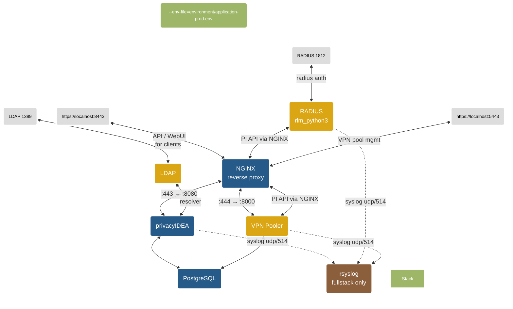

# privacyIDEA-docker

Simply deploy and run an MFA instance in a container environment powered and based on privacyIDEA.

## Overview 
[privacyIDEA](https://github.com/privacyidea/privacyidea) is an open solution for strong two-factor authentication like OTP tokens, SMS, smartphones or SSH keys. 

This project is a complete build environment under linux to build and run an MFA system in a container environment. It uses the [Wolfi OS](https://github.com/wolfi-dev) image and a fork of the [privacyIDEA-Project](https://github.com/privacyidea/privacyidea/). The image uses [gunicorn](https://gunicorn.org/) from PyPi to run the app. 

### tl;dr 
See [requirements](#prerequisites-and-requirements)

Clone repository and start a full privacyIDEA stack*: 
```
git clone --recurse-submodules https://github.com/ilya-maltsev/privacyidea-docker.git
cd privacyidea-docker
make cert build-all fullstack
```
Username / password: admin / admin

---

> [!Important] 
> The image does **not include** a reverse proxy or a database backend. Running the default image as a standalone container uses gunicorn and a sqlite database. Using sqlite is not suitable for a production environment.
>
> A more 'real-world' scenario, which is often used, is described in the [Compose a privacyIDEA stack](#compose-a-privacyidea-stack) section.
>
> Also check the [Security considerations](#security-considerations) before running the image or stack in a production environment.

**While decoupling the privacyIDEA image from dependencies like Nginx, Apache or database vendors ect., it is possible to run privacyIDEA with your favorite components.**

## Repository 

| Directory | Description |
|-----------|-------------|
| *conf* | contains *pi.cfg* and *logging.cfg* files which is included in the image build process.|
| *environment* | contains different example-environment files for a whole stack via docker compose|
| *scripts* | contains custom scripts for the privacyIDEA script-handler. The directory will be mounted into the container when composing a [stack](#compose-a-privacyidea-stack). Scripts must be executable (chmod +x)|
| *templates*| contains files used for different services (nginx, radius ...) and also contains the ssl certificate for the reverse-proxy. Replace it with your own certificate and key file. Use PEM-Format without a passphrase. \*.pfx is not supported. Name must be ***pi.pem*** and ***pi.key***. |
| *templates/rsyslog*| Dockerfile and config for the rsyslog log-collector container (fullstack profile only).|
| *rlm_python3*| git submodule — [FreeRADIUS rlm_python3 plugin](https://github.com/ilya-maltsev/rlm_python3) for privacyIDEA authentication. Replaces the legacy Perl-based rlm_perl plugin.|
| *pi-vpn-pooler*| git submodule — [VPN IP pool manager](https://github.com/ilya-maltsev/pi-vpn-pooler) that integrates with privacyIDEA API.|

## Submodules

This project uses git submodules for the FreeRADIUS plugin and VPN Pooler service. When cloning, use `--recurse-submodules`:

```
git clone --recurse-submodules https://github.com/ilya-maltsev/privacyidea-docker.git
```

If you already cloned without submodules, initialize them:

```
git submodule update --init --recursive
```

## Quickstart

### Prerequisites and requirements

- Installed a container runtime engine (docker / podman).
- Installed [BuildKit](https://docs.docker.com/build/buildkit/), [buildx](https://github.com/docker/buildx) and [Compose V2](https://docs.docker.com/compose/install/linux/) (docker-compose-v2) components
- The repository is tested with versions listed in [COMPAT.md](COMPAT.md)


#### Quick & Dirty

Build and run a simple local privacyIDEA container (standalone with sqlite):

```
git clone --recurse-submodules https://github.com/ilya-maltsev/privacyidea-docker.git
cd privacyidea-docker
make cert build run
```

Web-UI: http://localhost:8080

User/password: **admin**/**admin**

## Build images

All application images are built locally — no prebuilt cloud images are used.

### Build all images at once

Use `build-images.sh` to build all application images and pull infrastructure images:

```
bash build-images.sh build
```

Or use the Makefile target:

```
make build-all
```

The script automatically initializes git submodules before building.

### Build, export and import

For offline environments or transferring images between machines:

```
bash build-images.sh all       # build + export to privacyidea-images.tar.gz
bash build-images.sh export    # export only (images must exist)
bash build-images.sh import    # import from privacyidea-images.tar.gz
```

### Build a specific privacyIDEA version
```
make build PI_VERSION=3.13 PI_VERSION_BUILD=3.13
```

### Images built by this project

| Image | Source | Description |
|-------|--------|-------------|
| `privacyidea-docker:3.13` | `./Dockerfile` | privacyIDEA application |
| `privacyidea-freeradius:latest` | `./rlm_python3/` (submodule) | FreeRADIUS with rlm_python3 plugin |
| `pi-vpn-pooler:latest` | `./pi-vpn-pooler/` (submodule) | VPN IP pool manager |
| `privacyidea-rsyslog:latest` | `./templates/rsyslog/` | Centralized rsyslog collector (fullstack only) |

### Infrastructure images (pulled from registry)

| Image | Used by |
|-------|---------|
| `postgres:16-alpine` | Shared database for privacyIDEA and VPN Pooler |
| `nginx:stable-alpine` | Reverse proxy |
| `osixia/openldap:latest` | LDAP directory (optional, for testing) |

#### Push to a registry
Use ```make push [REGISTRY=<registry>]```to tag and push the image[^1]
##### Example 
Push image to local registry on port 5000[^2]

```
make push REGISTRY=localhost:5000
``` 

#### Remove the container:
```
make clean
```
You can start the container with the same database (sqlite) and configuration and use ```make run``` again without bootstrapping the instance.
#### Remove the container including volumes:
```
make distclean
```
&#9432; This will wipe the whole container including the volumes!

## Overview ```make``` targets

| target | optional ARGS | description | example
---------|----------|---|---------
| ```build ``` | ```PI_VERSION```<br> ```IMAGE_NAME```|Build the privacyIDEA image. Optional: specify the version and image name| ```make build PI_VERSION=3.13 PI_VERSION_BUILD=3.13```|
| ```build-all``` | |Build all images (privacyIDEA, FreeRADIUS, VPN Pooler, rsyslog) and pull infrastructure images| ```make build-all```|
| ```push``` | ```REGISTRY```|Tag and push the image to the registry. Optional: specify the registry URI. Defaults to *localhost:5000*| ```make push REGISTRY=docker.io/your-registry/privacyidea-docker```|
| ```run``` |  ```PORT``` <br> ```TAG```  |Run a standalone container with gunicorn and sqlite. Optional: specify the prefix tag of the container name and listen port. Defaults to *pi* and port *8080*| ```make run TAG=prod PORT=8888```|
| ```secret``` | |Generate secrets to use in an environment file | ```make secret```|
| ```cert``` | |Generate a self-signed certificate for the reverse proxy container in *./templates* and **overwrite** the existing one | ```make cert```|
| ```stack``` |```TAG``` ```PROFILE```| Run a production stack (db, privacyidea, reverse_proxy, freeradius, vpn_pooler). Default profile is *stack*. | ```make stack```, ```make stack TAG=dev PROFILE=fullstack```|
| ```fullstack``` || Run a full dev/test stack (all stack services + LDAP + rsyslog) | ```make fullstack```
| ```resolver``` || Create resolvers and realm for fullstack | ```make resolver```
| ```clean``` |```TAG```| Remove the container and network without removing the named volumes. Optional: change prefix tag of the container name. Defaults to *prod* | ```make clean TAG=prod```|
| ```distclean``` |```TAG```| Remove the container, network **and named volumes**. Optional: change prefix tag of the container name. Defaults to *prod* | ```make distclean TAG=prod```|

> [!Important] 
> Using the image as a standalone container is not production ready. For a more like 'production ready' instance, please read the next section.

## Compose a privacyIDEA stack

By using docker compose you can easily deploy a customized privacyIDEA instance, including Nginx as a reverse-proxy and PostgreSQL as a database backend.

With the use of different environment files for different full-stacks, you can deploy and run multiple stacks at the same time on different ports. 



Find example .env files in the *environment* directory.

### Profiles

| Profile | Services | Use case |
|---------|----------|----------|
| `stack` | db, privacyidea, reverse_proxy, freeradius, vpn_pooler | **Production** — full working set without LDAP |
| `fullstack` | all `stack` services + openldap, rsyslog | **Dev/testing** — includes LDAP with sample data and centralized log collection |
| `ldap` | openldap | LDAP directory only (add to other profiles) |

> [!Note]
> **Dev-only resolver seed.** `application-dev.env` sets `PI_SEED_RESOLVERS=true`, which tells `entrypoint.py` to run `pi-manage config import -i /privacyidea/etc/persistent/resolver.json` on first boot. The seed is idempotent (gated on a `resolver_imported` flag file) and is **not** enabled in `application-prod.env` — prod stacks start with an empty privacyIDEA configuration.

> [!Note]
> **Dev-only rsyslog collector.** The `fullstack` profile includes an `rsyslog` container that receives syslog messages (UDP 514) from privacyIDEA, FreeRADIUS and VPN Pooler on the internal Docker network. Logs are written to per-service files inside the `rsyslog_logs` volume (`privacyidea.log`, `privacyidea-radius.log`, `pi-vpn-pooler.log`, `all.log`). `application-dev.env` pre-configures all three services to forward to this collector. The `stack` (production) profile does **not** include rsyslog — configure your own external rsyslog host via the `*_SYSLOG_HOST` variables instead.

### Exposed ports (stack profile)

| Service | Host port | Protocol | Description |
|---------|-----------|----------|-------------|
| db (PostgreSQL) | `${DB_PORT:-5432}` | tcp | Database |
| privacyidea | `${PI_PORT:-8080}` | tcp | Direct gunicorn (use reverse_proxy for production) |
| reverse_proxy (privacyIDEA) | `${PROXY_PORT:-8443}` | tcp (HTTPS) | NGINX SSL termination → privacyIDEA :8080 |
| reverse_proxy (VPN Pooler) | `${VPN_POOLER_PORT:-5443}` | tcp (HTTPS) | NGINX SSL termination → VPN Pooler :8000 |
| freeradius | `${RADIUS_PORT:-1812}` | tcp + udp | RADIUS authentication |
| freeradius | `${RADIUS_PORT_INC:-1813}` | udp | RADIUS accounting |

> [!Note]
> Both privacyIDEA and VPN Pooler are plain HTTP services behind the NGINX reverse proxy which terminates TLS. The `vpn_pooler` container only exposes port 8000 internally and is **not** published to the host — all external access goes through `reverse_proxy` on `${VPN_POOLER_PORT}`.

- The openldap container is only available with `fullstack` or `ldap` profiles (dev/testing only).
- The rsyslog container is only available with the `fullstack` profile (dev/testing only). It does not expose any ports to the host.
- The radius container is built locally from the [rlm_python3](https://github.com/ilya-maltsev/rlm_python3) submodule.
- The VPN Pooler is built locally from the [pi-vpn-pooler](https://github.com/ilya-maltsev/pi-vpn-pooler) submodule.
- The openldap uses the [osixia/docker-openldap](https://github.com/osixia/docker-openldap) image.

---
### Examples:

Build all images and run a full stack:

```
make cert build-all fullstack
```

Run a stack with project the name *prod* and environment variables files from *environment/application-prod.env*

```
  $ make cert  #run only once to generate certificate
  $ docker compose --env-file=environment/application-prod.env -p prod --profile=stack up -d
```
Or simple run a ```make``` target.

This example will start a production stack including **PostgreSQL**, **privacyIDEA**, **reverse_proxy**, **FreeRADIUS** and **VPN Pooler**:
```
make cert stack
```

This example will start a full stack (dev) including all production services **plus OpenLDAP** with sample data, users and realms, and a centralized **rsyslog** collector. Project tag is *prod*:

```
make cert fullstack 
```

> [!Note]
> The ldap have sample users. The resolvers and realm are already configured in privacyIDEA when stack is ready.

Shutdown the stack with the project name *prod* and **remove** all resources (container,networks, etc.) except the volumes.

```
docker compose -p prod down 
```

You can start the stack in the background with console detached using the **-d** parameter.

```
  $ docker compose --env-file=environment/application-prod.env -p prod --profile=stack up -d
```

Full example including build with  ```make```targets:
```
make cert build-all stack PI_VERSION=3.13 PI_VERSION_BUILD=3.13 TAG=pidev
```
---
Now you can deploy additional containers like OpenLDAP for user realms or Owncloud as a client to test 2FA authentication. 

Have fun!

> [!IMPORTANT] 
>- Volumes will not be deleted. 
>- Delete the files in */privacyidea/etc/persistent/ **inside* the privacyIDEA container if you want to bootstrap again. This will not delete an existing database except sqlite databases!
>- Compose a stack takes some time until the database tables are deployed and privacyIDEA is ready to run. Check health status of the container.


## Database

This project uses **PostgreSQL 16** as the database backend.

A single PostgreSQL instance is shared between privacyIDEA and VPN Pooler. Each application uses its own database:

| Database | User | Used by |
|----------|------|---------|
| `pi` | `pi` | privacyIDEA |
| `vpn_pooler` | `vpn_pooler` | VPN Pooler |

The VPN Pooler database and user are created automatically on first start via the init script `templates/init-vpn-pooler-db.sh`.

> [!Note]
> privacyIDEA uses `psycopg2` as the PostgreSQL adapter. Since privacyIDEA 3.3, the PostgreSQL adapter is not included in the default installation (see [privacyIDEA FAQ](https://privacyidea.readthedocs.io/en/stable/faq/mysqldb.html)). This project installs `psycopg2-binary` explicitly in the Dockerfile.


## Environment Variables

### privacyIDEA
| Variable | Default | Description
|-----|---------|-------------
```ENVIRONMENT``` | environment/application-prod.env | Used to set the correct environment file (env_file) in the docker compose, which is used by the container. Use a relative filename here.
```PI_VERSION```|latest| Set the used image version
```PI_ADMIN```|admin| login name of the initial administrator
```PI_ADMIN_PASS```|admin| password for the initial administrator
```PI_PASSWORD```|admin| Password for the admin user. See [Security considerations](#security-considerations) for more information.
```PI_PEPPER``` | changeMe | Used for ```PI_PEPPER``` in pi.cfg. The filename, including the path, to the file **inside** the container, with the secret. Use `make secrets` to generate new random secrets to use with an environment file See [Security considerations](#security-considerations) for more information.
```PI_SECRET``` | changeMe | Used for ```SECRET_KEY``` in pi.cfg. Use `make secrets` to generate new random secrets to use with an environment file. See [Security considerations](#security-considerations) for more information.
```PI_ENCKEY```|| The enckey file for DB-encryption (base64). Only used if exists. Otherwise it will be generated using the ```pi-manage``` command. See [privacy documentation](https://privacyidea.readthedocs.io/en/latest/faq/crypto-considerations.html?highlight=enckey) how to create a key.
```PI_PORT```|8080| Port used by gunicorn. Don't use this directly in productive environments. Use a reverse proxy.
```PI_LOGLEVEL```|INFO| Log level in uppercase (DEBUG, INFO, WARNING, ect.). 
```SUPERUSER_REALM```|"admin,helpdesk"| Admin realms, which can be used for policies in privacyIDEA. Comma separated list. See the privacyIDEA documentation for more information.
```PI_SQLALCHEMY_ENGINE_OPTIONS```| False | Set pool_pre_ping option. Set to ```True``` for DB clusters.
```PI_SEED_RESOLVERS```| *(unset)* | Dev-only one-shot seed. When set to `true`, `entrypoint.py` runs `pi-manage config import -i /privacyidea/etc/persistent/resolver.json` on first boot and writes a `resolver_imported` flag file so re-runs don't re-import or overwrite admin tweaks. Set only in `application-dev.env`; leave unset in prod.
```PI_SYSLOG_ENABLED```| false | Enable remote syslog forwarding from the privacyIDEA application. When `false`, logs only go to stdout / container logs.
```PI_SYSLOG_HOST```| *(empty)* | Remote rsyslog host. Required when `PI_SYSLOG_ENABLED=true`.
```PI_SYSLOG_PORT```| 514 | Remote rsyslog port.
```PI_SYSLOG_PROTO```| udp | Transport for remote rsyslog: `udp` or `tcp`.
```PI_SYSLOG_FACILITY```| local1 | Syslog facility.
```PI_SYSLOG_TAG```| privacyidea | Syslog program name / ident.
```PI_SYSLOG_LEVEL```| INFO | Minimum level forwarded: `DEBUG`, `INFO`, `WARNING`, `ERROR`, `CRITICAL`.

**Additional environment variables** starting with ```PI_``` will automatically added to ```pi.cfg```

### DB connection parameters
| Variable | Default | Description
|-----|---------|-------------
```DB_HOST```| db | Database host
```DB_PORT```| 5432 | Database port
```DB_NAME```| pi | Database name
```DB_USER```| pi | Database user
```DB_PASSWORD```| superSecret | The database password.
```DB_API```| postgresql+psycopg2 | Database driver for SQLAlchemy

### Reverse proxy parameters (for compose/stack)

The nginx `reverse_proxy` terminates TLS for **both** privacyIDEA (host `${PROXY_PORT}` → container `:443`) and VPN Pooler (host `${VPN_POOLER_PORT}` → container `:444`), using the same certificate pair. The `vpn_pooler` container speaks plain HTTP on `:8000` inside the compose network and is not published to the host.

| Variable | Default | Description
|-----|---------|-------------
```PROXY_PORT```| 8443 | Exposed HTTPS port for privacyIDEA.
```PROXY_SERVERNAME```| localhost | Set the reverse-proxy server name. Should be the common name used in the certificate.
```NGINX_TLS_CERT_PATH```| /etc/nginx/ssl/pi.pem | Container-side path to the TLS certificate. Dev default is the self-signed `templates/pi.pem` bind-mounted into the container. In prod, mount your real cert (bind mount, Docker secret, etc.) and point this at the mount target.
```NGINX_TLS_KEY_PATH```| /etc/nginx/ssl/pi.key | Container-side path to the TLS private key. Same mechanism as `NGINX_TLS_CERT_PATH`.

### RADIUS parameters (for compose/fullstack)
| Variable | Default | Description
|-----|---------|-------------
```RADIUS_PORT```| 1812 | Exposed (external) radius port tcp/udp
```RADIUS_PORT_INC```| 1813 | Additional exposed (external) radius port udp
```RADIUS_PI_REALM```| | privacyIDEA realm for RADIUS authentication
```RADIUS_PI_RESCONF```| | privacyIDEA resolver configuration for RADIUS
```RADIUS_PI_SSLCHECK```| false | Enable SSL certificate verification for privacyIDEA API
```RADIUS_DEBUG```| false | Enable DEBUG-level logging in the rlm_python3 plugin. When `true`, dumps the full incoming RADIUS request, URL params, HTTP request/response packets to privacyIDEA, and the outgoing RADIUS reply. See [Syslog and DEBUG logging](#syslog-and-debug-logging).
```RADIUS_PI_TIMEOUT```| 10 | Timeout (seconds) for privacyIDEA API requests
```RADIUS_SYSLOG```| true | Enable syslog output from the rlm_python3 plugin (in addition to `radiusd.radlog`). When `false`, logs only go to the FreeRADIUS log.
```RADIUS_SYSLOG_HOST```| *(empty)* | Remote rsyslog host. Empty uses the local syslogd inside the container.
```RADIUS_SYSLOG_PORT```| 514 | Remote rsyslog port.
```RADIUS_SYSLOG_PROTO```| udp | Transport for remote rsyslog: `udp` or `tcp`.
```RADIUS_SYSLOG_FACILITY```| auth | Syslog facility: `auth`, `authpriv`, `daemon`, `local0`..`local7`.
```RADIUS_SYSLOG_TAG```| privacyidea-radius | Syslog program name / ident.
```RADIUS_SYSLOG_LEVEL```| INFO | Minimum level forwarded to syslog: `DEBUG`, `INFO`, `WARNING`, `ERROR`, `CRITICAL`. Must be `DEBUG` to see full-packet dumps from `RADIUS_DEBUG=true`.

### VPN Pooler parameters (for compose/vpn_pooler)
| Variable | Default | Description
|-----|---------|-------------
```VPN_POOLER_DB_NAME```| vpn_pooler | VPN Pooler database name
```VPN_POOLER_DB_USER```| vpn_pooler | VPN Pooler database user
```VPN_POOLER_DB_PASSWORD```| changeme | VPN Pooler database password
```VPN_POOLER_PI_API_URL```| https://reverse_proxy:443 | privacyIDEA API URL
```VPN_POOLER_PI_VERIFY_SSL```| false | Verify SSL certificate of privacyIDEA API
```VPN_POOLER_DJANGO_SECRET_KEY```| changeme | Django secret key
```VPN_POOLER_DJANGO_DEBUG```| false | Enable Django debug mode
```VPN_POOLER_DJANGO_ALLOWED_HOSTS```| * | Django allowed hosts
```VPN_POOLER_CSRF_TRUSTED_ORIGINS```| https://localhost:5443 | CSRF trusted origins
```VPN_POOLER_PORT```| 5443 | Exposed port for VPN Pooler
```VPN_POOLER_SYSLOG_ENABLED```| false | Enable remote syslog forwarding from Django. When `false`, logs only go to stdout / container logs.
```VPN_POOLER_SYSLOG_HOST```| *(empty)* | Remote rsyslog host. Required when `VPN_POOLER_SYSLOG_ENABLED=true`.
```VPN_POOLER_SYSLOG_PORT```| 514 | Remote rsyslog port.
```VPN_POOLER_SYSLOG_PROTO```| udp | Transport for remote rsyslog: `udp` or `tcp`.
```VPN_POOLER_SYSLOG_FACILITY```| local0 | Syslog facility.
```VPN_POOLER_SYSLOG_TAG```| pi-vpn-pooler | Syslog program name / ident.
```VPN_POOLER_SYSLOG_LEVEL```| INFO | Minimum level forwarded: `DEBUG`, `INFO`, `WARNING`, `ERROR`, `CRITICAL`. Set to `DEBUG` to capture full HTTP request/response packets against the privacyIDEA API. See [Syslog and DEBUG logging](#syslog-and-debug-logging).

### LDAP parameters (for compose/fullstack)
| Variable | Default | Description
|-----|---------|-------------
```LDAP_PORT```| 1389 | Exposed (external) ldap port

### Other values (for compose/fullstack)

- Openldap admin user: ```cn=admin,dc=example,dc=org``` with password ```openldap```
- Password for ldap user always givenName in lowercase (e.g. Sandra Bullock = sandra)
- Additional user ```helpdesk``` with password ```helpdesk``` and ```admin``` with password ```admin``` available in ldap.

#### Certificates

The nginx `reverse_proxy` service serves TLS on two ports (privacyIDEA `:443`, VPN Pooler `:444`) from a single cert/key pair.

- **Dev**: `make cert` generates `templates/pi.pem` + `templates/pi.key`; compose bind-mounts them to `/etc/nginx/ssl/pi.pem` + `/etc/nginx/ssl/pi.key`, and `NGINX_TLS_CERT_PATH` / `NGINX_TLS_KEY_PATH` default to those paths.
- **Prod**: mount your real certificate and key into the `reverse_proxy` container (additional bind mount, Docker secret, or your orchestrator's equivalent) and set `NGINX_TLS_CERT_PATH` / `NGINX_TLS_KEY_PATH` in `application-prod.env` to the container-side paths. Use PEM without a passphrase; `.pfx` is not supported.

## Syslog and DEBUG logging

The **privacyIDEA** application, the **rlm_python3** RADIUS plugin, and the **pi-vpn-pooler** Django app can all forward application logs to an rsyslog server. Everything is configurable via the `PI_SYSLOG_*` / `RADIUS_SYSLOG_*` / `VPN_POOLER_SYSLOG_*` environment variables described in the [privacyIDEA](#privacyidea), [RADIUS](#radius-parameters-for-composefullstack) and [VPN Pooler](#vpn-pooler-parameters-for-composevpn_pooler) tables above. Defaults: transport `udp`, port `514`, level `INFO`; remote forwarding is off until a host is set.

- **Dev (fullstack)**: the `rsyslog` container is included in the stack and `application-dev.env` pre-configures all three services to forward to it. Logs are written to the `rsyslog_logs` volume as per-service text files (`privacyidea.log`, `privacyidea-radius.log`, `pi-vpn-pooler.log`, `all.log`).
- **Prod (stack)**: no rsyslog container is included. Set `PI_SYSLOG_HOST` / `RADIUS_SYSLOG_HOST` / `VPN_POOLER_SYSLOG_HOST` to your own syslog infrastructure.

### Two log tiers

| Level | What you get |
|-------|--------------|
| `INFO` (default) | One-line operational events per request: auth result, challenge issued, token serial on success, accounting start/stop, pool allocate/release, sync start/complete, PI internal errors, login failures. Safe for production. |
| `DEBUG` | Everything at INFO, plus full-packet dumps (see below). Verbose — intended for troubleshooting. |

### Full-packet DEBUG dumps

When `RADIUS_DEBUG=true` **and** `RADIUS_SYSLOG_LEVEL=DEBUG` (or inspecting the FreeRADIUS log), the rlm_python3 plugin logs:

- Every incoming RADIUS attribute (`RAD_REQUEST:`) and accounting attribute (`ACCT_REQUEST:`)
- Every URL parameter built for privacyIDEA (`urlparam`)
- The full outbound HTTP request: method, URL, headers, body (`PI HTTP >>>`)
- The full inbound HTTP response: status, reason, headers, body (`PI HTTP <<<`)
- The full outbound RADIUS reply: return code, reply pairs, config pairs (`RADIUS reply <<<`)

With `VPN_POOLER_SYSLOG_LEVEL=DEBUG` (or Django `DEBUG=true`), the pi-vpn-pooler `PIClient` logs `PI HTTP >>>` / `PI HTTP <<<` for every call to the privacyIDEA API — method, URL, headers, query params, body, response status, response body.

### Secret redaction

Packet dumps are **redacted by default** — this is not a toggle. The plugin and the pooler both strip values of any attribute, header, URL param, or JSON field whose name (case-insensitive) contains:

`password`, `pass`, `chap-challenge`, `chap-response`, `chap-password`, `mschap`, `ms-chap`, `authorization`, `pi-authorization`, `cookie`, `token`, `secret`

Matched values are replaced with `***` before the message is emitted. This covers `User-Password`, CHAP/MS-CHAP material, the `PI-Authorization` JWT header, the `token` field in `/auth` responses, and any key the NAS or privacyIDEA returns that matches a secret substring. JSON response bodies are parsed and redacted recursively; bodies that fail to parse are logged verbatim.

> [!Note]
> The redaction list is conservative, not exhaustive. Review the DEBUG output in a test environment before forwarding to a central log aggregator in production.

### Quick test (fullstack)

The `fullstack` profile already includes the `rsyslog` collector and `application-dev.env` points both services at it. Just start the stack and read the logs:

```
make cert build-all fullstack
docker exec dev-rsyslog-1 tail -f /var/log/remote/all.log
```

Per-service files:
- `/var/log/remote/privacyidea.log`
- `/var/log/remote/privacyidea-radius.log`
- `/var/log/remote/pi-vpn-pooler.log`
- `/var/log/remote/all.log` (combined)

### Quick test (stack / manual)

For production stacks or manual testing, start a UDP listener on the host:

```
nc -u -l 1514
```

Then in your env file:

```
PI_SYSLOG_ENABLED=true
PI_SYSLOG_HOST=host.docker.internal
PI_SYSLOG_PORT=1514
PI_SYSLOG_LEVEL=INFO

RADIUS_SYSLOG_HOST=host.docker.internal
RADIUS_SYSLOG_PORT=1514
RADIUS_SYSLOG_LEVEL=DEBUG
RADIUS_DEBUG=true

VPN_POOLER_SYSLOG_ENABLED=true
VPN_POOLER_SYSLOG_HOST=host.docker.internal
VPN_POOLER_SYSLOG_PORT=1514
VPN_POOLER_SYSLOG_LEVEL=DEBUG
```

## Security considerations

#### Secrets 
The current concept of using secrets with environment variables is not recommended in a docker-swarm/k8s/cloud environment. You should use  [secrets](https://docs.docker.com/engine/swarm/secrets/) in such an environment. You can modify and re-write the pi.cfg to read secret files inside the container/pod via python. 


## Frequently Asked Questions

#### Why are not all pi.cfg parameters available as environment variables?
- There is only the most essential and often-used parameters included. You can add more variables to the *conf/pi.conf* file and build your own image.

#### How can I rotate the audit log?

- Simply use a cron job on the host system with docker exec and the pi-manage command: 
```
docker exec -it prod-privacyidea-1 pi-manage audit rotate_audit --age 90
```
#### How can I access the logs?

- Use docker log:  
```
docker logs prod-privacyidea-1 
```

#### How can I update the container to a new privacyIDEA version?
- Build a new image, make a push and pull. Re-create the container with additional argument ```PIUPDATE```. This will run the schema update script to update the database. Or use the ```privacyidea-schema-upgrade``` script.

#### Can I import a privacyIDEA database dump into the database container from the stack?
- Yes, by providing the sql dump to the db container. Please refer to the *"Initialization scripts"* section from the official [PostgreSQL docker documentation](https://hub.docker.com/_/postgres).

#### Help! ```make build``` does not work, how can I fix it?

- Check the [Prerequisites and requirements](#prerequisites-and-requirements). Often there is a missing plugin (buildx, compose) - install the plugins and try again:
```
DOCKER_CONFIG=${DOCKER_CONFIG:-$HOME/.docker}
mkdir -p $DOCKER_CONFIG/cli-plugins
curl -SL https://github.com/docker/compose/releases/download/v2.23.3/docker-compose-linux-x86_64 -o $DOCKER_CONFIG/cli-plugins/docker-compose
curl -SL https://github.com/docker/buildx/releases/download/v0.12.0/buildx-v0.12.0.linux-amd64 -o $DOCKER_CONFIG/cli-plugins/docker-buildx
chmod +x $DOCKER_CONFIG/cli-plugins/docker-{buildx,compose}
```

#### Help! Stack is not starting because of an error like ```permission denied```. How can I fix it?

Check selinux and change the permissions like:
```
chcon -R -t container_file_t PATHTOHOSTDIR
```
```PATHTOHOSTDIR``` should point to the privacyidea-docker folder.

#### Help! ```make push```does not work with my local registry, how can I fix it?

- Maybe you try to use ssl: Use the insecure option in your */etc/containers/registries.conf*: 
   ```
   [[registry]]
   prefix="localhost"
   location="localhost:5000"
   insecure=true
   ```
#### How can I create a backup of my data?

- Save environment files (**enckey** ect.) which are stored persistent in the containers volume. 
- Dump your database manually:

For the example stack, use the db container: 

```
docker exec -it prod-db-1 pg_dump -U pi pi
```

To dump the VPN Pooler database:

```
docker exec -it prod-db-1 pg_dump -U vpn_pooler vpn_pooler
```

# Disclaimer

This project is a fork of [gpappsoft/privacyidea-docker](https://github.com/gpappsoft/privacyidea-docker). The project uses the open-source version of privacyIDEA. There is no official support from NetKnights for this project.

[^1]: If you push to external registries, you may have to login first.
[^2]: You can run your own local registry with:\
   ``` docker  run -d -p 5000:5000 --name registry registry:2.7 ``` 
