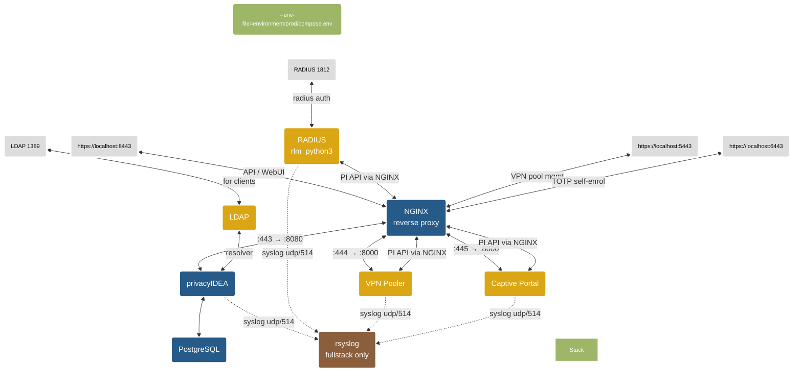

🌐 [English](README.md) | **Русский**

# privacyIDEA-docker

Простое развертывание и запуск экземпляра MFA в контейнерной среде на базе privacyIDEA.

## Обзор
[privacyIDEA](https://github.com/privacyidea/privacyidea) — это открытое решение для строгой двухфакторной аутентификации с поддержкой OTP-токенов, SMS, смартфонов и SSH-ключей.

Этот проект представляет собой готовую среду сборки под Linux для создания и запуска MFA-системы в контейнерной среде. Используется образ [Wolfi OS](https://github.com/wolfi-dev) и форк [проекта privacyIDEA](https://github.com/privacyidea/privacyidea/). Для запуска приложения используется [gunicorn](https://gunicorn.org/) из PyPi.

### tl;dr
См. [требования](#предварительные-требования)

Клонируйте репозиторий и запустите полный стек privacyIDEA*:
```
git clone --recurse-submodules https://github.com/ilya-maltsev/privacyidea-docker.git
cd privacyidea-docker
make cert build-all fullstack
```
Имя пользователя / пароль: admin / admin

---

> [!Important]
> Образ **не включает** обратный прокси и серверную часть базы данных. Запуск образа по умолчанию как отдельного контейнера использует gunicorn и базу данных sqlite. Использование sqlite не подходит для продуктивной среды.
>
> Более приближённый к реальности сценарий описан в разделе [Создание стека privacyIDEA](#создание-стека-privacyidea).
>
> Также ознакомьтесь с разделом [Вопросы безопасности](#вопросы-безопасности) перед запуском образа или стека в продуктивной среде.

**Благодаря отделению образа privacyIDEA от таких зависимостей, как Nginx, Apache или поставщики баз данных, вы можете запускать privacyIDEA с любыми предпочитаемыми компонентами.**

## Репозиторий

| Каталог | Описание |
|---------|----------|
| *conf* | содержит файлы *pi.cfg* и *logging.cfg*, которые используются при сборке образа.|
| *environment* | файлы окружения для каждого сервиса, организованные по стекам (`environment/prod/`, `environment/dev/`). У каждого сервиса свой файл `.env`; `compose.env` содержит переменные уровня compose (порты, пути TLS).|
| *scripts* | содержит пользовательские скрипты для обработчика скриптов privacyIDEA. Каталог монтируется в контейнер при создании [стека](#создание-стека-privacyidea). Скрипты должны быть исполняемыми (chmod +x)|
| *templates*| содержит файлы для различных сервисов (nginx, radius ...), самоподписанный SSL-сертификат для разработки (`pi.pem` / `pi.key`) и шаблон systemd-сервиса. Для продуктивного TLS задайте `NGINX_TLS_CERT_PATH` / `NGINX_TLS_KEY_PATH` в файле окружения, указав путь к вашему настоящему сертификату/ключу (PEM без парольной фразы; `.pfx` не поддерживается). |
| *templates/rsyslog*| Dockerfile и конфигурация для контейнера rsyslog — сборщика логов (только в профиле fullstack).|
| *rlm_python3*| git-подмодуль — [плагин FreeRADIUS rlm_python3](https://github.com/ilya-maltsev/rlm_python3) для аутентификации privacyIDEA. Заменяет устаревший Perl-плагин rlm_perl.|
| *pi-vpn-pooler*| git-подмодуль — [менеджер пулов VPN IP-адресов](https://github.com/ilya-maltsev/pi-vpn-pooler), интегрированный с API privacyIDEA.|
| *pi-custom-captive*| git-подмодуль — [пользовательский captive-портал](https://github.com/ilya-maltsev/pi-custom-captive) для самостоятельной регистрации TOTP (Google Authenticator) с ограниченным управлением токенами администратора. Одноразовая регистрация: пользователь может зарегистрировать токен только один раз, после чего доступ блокируется до тех пор, пока администратор не удалит/отвяжет токен.|

## Подмодули

Этот проект использует git-подмодули для плагина FreeRADIUS, сервиса VPN Pooler и Captive Portal. При клонировании используйте `--recurse-submodules`:

```
git clone --recurse-submodules https://github.com/ilya-maltsev/privacyidea-docker.git
```

Если вы уже клонировали без подмодулей, инициализируйте их:

```
git submodule update --init --recursive
```

## Быстрый старт

### Предварительные требования

- Установлена среда выполнения контейнеров (docker / podman).
- Установлены компоненты [BuildKit](https://docs.docker.com/build/buildkit/), [buildx](https://github.com/docker/buildx) и [Compose V2](https://docs.docker.com/compose/install/linux/) (docker-compose-v2)
- Репозиторий протестирован с версиями, перечисленными в [COMPAT.md](COMPAT.md)


#### Быстрый запуск

Сборка и запуск простого локального контейнера privacyIDEA (автономный с sqlite):

```
git clone --recurse-submodules https://github.com/ilya-maltsev/privacyidea-docker.git
cd privacyidea-docker
make cert build run
```

Веб-интерфейс: http://localhost:8080

Логин/пароль: **admin**/**admin**

## Сборка образов

Все образы приложений собираются локально — предсобранные облачные образы не используются.

### Сборка всех образов сразу

Используйте `build-images.sh` для сборки всех образов приложений и загрузки инфраструктурных образов:

```
bash build-images.sh build
```

Или используйте цель Makefile:

```
make build-all
```

Скрипт автоматически инициализирует git-подмодули перед сборкой.

### Сборка, экспорт и импорт

Для изолированных сред или переноса образов между машинами. Архив включает полный репозиторий (Makefile, compose-файлы, шаблоны окружения, конфигурации) и все Docker-образы в одном файле `.tar.gz`:

```
bash build-images.sh all       # сборка + экспорт в privacyidea-images.tar.gz
bash build-images.sh export    # только экспорт (образы должны существовать)
bash build-images.sh import    # импорт из docker-images.tar (сначала распакуйте архив)
```

Вы можете работать с конкретными образами, передавая короткие имена после команды:

```
bash build-images.sh build captive pooler    # собрать только captive + vpn_pooler
bash build-images.sh export pi radius        # экспортировать выбранные образы + репозиторий
bash build-images.sh all captive             # собрать + экспортировать только captive
bash build-images.sh help                    # показать доступные короткие имена
```

Короткие имена: `privacyidea` (`pi`), `freeradius` (`radius`), `pooler` (`vpn_pooler`), `captive`, `postgres`, `nginx`, `openldap` (`ldap`).

### Сборка определённой версии privacyIDEA
```
make build PI_VERSION=3.13 PI_VERSION_BUILD=3.13
```

### Образы, собираемые этим проектом

| Образ | Исходник | Описание |
|-------|----------|----------|
| `privacyidea-docker:3.13` | `./Dockerfile` | Приложение privacyIDEA |
| `privacyidea-freeradius:latest` | `./rlm_python3/` (подмодуль) | FreeRADIUS с плагином rlm_python3 |
| `pi-vpn-pooler:latest` | `./pi-vpn-pooler/` (подмодуль) | Менеджер пулов VPN IP-адресов |
| `pi-custom-captive:latest` | `./pi-custom-captive/` (подмодуль) | Captive-портал для самостоятельной регистрации TOTP |
| `privacyidea-rsyslog:latest` | `./templates/rsyslog/` | Централизованный сборщик rsyslog (только для fullstack) |

### Инфраструктурные образы (загружаются из реестра)

| Образ | Используется для |
|-------|------------------|
| `postgres:16-alpine` | База данных для privacyIDEA |
| `nginx:stable-alpine` | Обратный прокси |
| `osixia/openldap:latest` | LDAP-каталог (опционально, для тестирования) |

#### Публикация в реестр
Используйте ```make push [REGISTRY=<registry>]``` для тегирования и публикации образа[^1]
##### Пример
Публикация образа в локальный реестр на порту 5000[^2]

```
make push REGISTRY=localhost:5000
```

#### Удаление контейнера:
```
make clean
```
Вы можете запустить контейнер с той же базой данных (sqlite) и конфигурацией, снова используя ```make run``` без повторной инициализации экземпляра.
#### Удаление контейнера вместе с данными:
```
make distclean
```
&#9432; Это удалит все контейнеры **и** каталоги `data/` (база данных, постоянная конфигурация и т.д.)!

## Обзор целей ```make```

| Цель | Необязательные аргументы | Описание | Пример
---------|----------|---|---------
| ```build ``` | ```PI_VERSION```<br> ```IMAGE_NAME```|Сборка образа privacyIDEA. Опционально: указать версию и имя образа| ```make build PI_VERSION=3.13 PI_VERSION_BUILD=3.13```|
| ```build-all``` | |Сборка всех образов (privacyIDEA, FreeRADIUS, VPN Pooler, Captive Portal, rsyslog) и загрузка инфраструктурных образов| ```make build-all```|
| ```push``` | ```REGISTRY```|Тегирование и публикация образа в реестр. Опционально: указать URI реестра. По умолчанию *localhost:5000*| ```make push REGISTRY=docker.io/your-registry/privacyidea-docker```|
| ```run``` |  ```PORT``` <br> ```TAG```  |Запуск автономного контейнера с gunicorn и sqlite. Опционально: указать префикс тега имени контейнера и порт. По умолчанию *pi* и порт *8080*| ```make run TAG=prod PORT=8888```|
| ```secrets``` | ```TAG``` | Генерация и запись случайных секретов в файлы окружения сервисов в `environment/{TAG}/`. Покрывает `PI_SECRET`, `PI_PEPPER`, `PI_ADMIN_PASS`, `PI_ENCKEY`, `DB_PASSWORD` (синхронизируется между `db.env` и `privacyidea.env`), а также секретные ключи Django для VPN Pooler и Captive Portal. | ```make secrets```, ```make secrets TAG=dev```|
| ```cert``` | |Генерация самоподписанного сертификата для контейнера обратного прокси в *./templates* с **перезаписью** существующего | ```make cert```|
| ```stack``` |```TAG``` ```PROFILE```| Запуск продуктивного стека (db, privacyidea, reverse_proxy, freeradius, vpn_pooler, captive). Профиль по умолчанию — *stack*. | ```make stack```, ```make stack TAG=dev PROFILE=fullstack```|
| ```fullstack``` || Запуск полного стека для разработки/тестирования (все сервисы stack + LDAP + rsyslog) | ```make fullstack```
| ```superadmin-policy``` | ```TAG``` | Импорт политики суперадминистратора (`templates/superadmin-policy.json`) в работающий экземпляр privacyIDEA. Включает права API для администраторов, панель мониторинга WebUI и политику самообслуживания для регистрации TOTP через captive-портал. | ```make superadmin-policy```, ```make superadmin-policy TAG=dev```|
| ```resolver``` || Создание резолверов и реалма для fullstack | ```make resolver```
| ```install-service``` |```SERVICE_USER``` ```SERVICE_WORKDIR```| Создание пользователя сервиса (при необходимости), добавление в группу docker, установка владельца каталога, установка и активация systemd-сервиса. По умолчанию пользователь `privacyidea` и текущий каталог. | ```make install-service```, ```make install-service SERVICE_USER=privacyidea SERVICE_WORKDIR=/opt/privacyidea-docker```|
| ```uninstall-service``` || Остановка, деактивация и удаление systemd-сервиса | ```make uninstall-service```|
| ```clean``` |```TAG```| Удаление контейнера и сети без удаления именованных томов. Опционально: изменить префикс тега имени контейнера. По умолчанию *prod* | ```make clean TAG=prod```|
| ```distclean``` |```TAG```| Удаление контейнеров, сетей, **именованных томов** (dev) **и каталогов данных** (prod). По умолчанию *prod* | ```make distclean TAG=prod```|

> [!Important]
> Использование образа как автономного контейнера не подходит для продуктивной среды. Для развертывания, приближённого к продуктивному, прочитайте следующий раздел.

## Создание стека privacyIDEA

С помощью docker compose вы можете легко развернуть настроенный экземпляр privacyIDEA, включая Nginx в качестве обратного прокси и PostgreSQL в качестве серверной части базы данных.

Используя различные файлы окружения для разных стеков, вы можете развертывать и запускать несколько стеков одновременно на разных портах.



Файлы окружения организованы по сервисам в каталогах `environment/prod/` и `environment/dev/`. У каждого сервиса свой файл `.env`; `compose.env` содержит переменные уровня compose (порты, пути TLS). Подробнее см. [Переменные окружения](#переменные-окружения).

### Профили

| Профиль | Сервисы | Назначение |
|---------|---------|------------|
| `stack` | db, privacyidea, reverse_proxy, freeradius, vpn_pooler, captive | **Продуктивная среда** — полный рабочий набор без LDAP |
| `fullstack` | все сервисы `stack` + openldap, rsyslog | **Разработка/тестирование** — включает LDAP с тестовыми данными и централизованный сбор логов |
| `ldap` | openldap | Только LDAP-каталог (можно добавить к другим профилям) |

> [!Note]
> **Инициализация резолверов только для dev.** `environment/dev/privacyidea.env` устанавливает `PI_SEED_RESOLVERS=true`, что указывает `entrypoint.py` выполнить `pi-manage config import -i /privacyidea/etc/persistent/resolver.json` при первом запуске. Инициализация идемпотентна (контролируется флаговым файлом `resolver_imported`) и **не** включена в prod-окружении — продуктивные стеки запускаются с пустой конфигурацией privacyIDEA. Используйте `make superadmin-policy` для импорта начальных политик администратора в prod.

> [!Note]
> **Сборщик rsyslog только для dev.** Профиль `fullstack` включает контейнер `rsyslog`, который принимает syslog-сообщения (UDP 514) от privacyIDEA, FreeRADIUS, VPN Pooler и Captive Portal во внутренней сети Docker. Логи записываются в файлы по сервисам внутри тома `rsyslog_logs` (`privacyidea.log`, `privacyidea-radius.log`, `pi-vpn-pooler.log`, `pi-custom-captive.log`, `all.log`). `application-dev.env` предварительно настраивает все четыре сервиса для пересылки в этот сборщик. Профиль `stack` (продуктивный) **не** включает rsyslog — настройте свой внешний rsyslog-сервер через переменные `*_SYSLOG_HOST`.

### Открытые порты (профиль stack)

| Сервис | Порт на хосте | Протокол | Описание |
|--------|---------------|----------|----------|
| db (PostgreSQL) | `${DB_PORT:-5432}` | tcp | База данных |
| privacyidea | `${PI_PORT:-8080}` | tcp | Прямой доступ через gunicorn (для продуктива используйте reverse_proxy) |
| reverse_proxy (privacyIDEA) | `${PROXY_PORT:-8443}` | tcp (HTTPS) | NGINX SSL-терминация → privacyIDEA :8080 |
| reverse_proxy (VPN Pooler) | `${VPN_POOLER_PORT:-5443}` | tcp (HTTPS) | NGINX SSL-терминация → VPN Pooler :8000 |
| reverse_proxy (Captive Portal) | `${CAPTIVE_PORT:-6443}` | tcp (HTTPS) | NGINX SSL-терминация → Captive Portal :8000 |
| freeradius | `${RADIUS_PORT:-1812}` | tcp + udp | RADIUS-аутентификация |
| freeradius | `${RADIUS_PORT_INC:-1813}` | udp | RADIUS-учёт |

> [!Note]
> privacyIDEA, VPN Pooler и Captive Portal — это HTTP-сервисы без шифрования за обратным прокси NGINX, который выполняет терминацию TLS. Контейнеры `vpn_pooler` и `captive` открывают порт 8000 только внутри сети и **не** публикуются на хосте — весь внешний доступ идёт через `reverse_proxy` по портам `${VPN_POOLER_PORT}` / `${CAPTIVE_PORT}`.

- Контейнер openldap доступен только с профилями `fullstack` или `ldap` (только для разработки/тестирования).
- Контейнер rsyslog доступен только с профилем `fullstack` (только для разработки/тестирования). Он не открывает порты на хосте.
- Контейнер radius собирается локально из подмодуля [rlm_python3](https://github.com/ilya-maltsev/rlm_python3).
- VPN Pooler собирается локально из подмодуля [pi-vpn-pooler](https://github.com/ilya-maltsev/pi-vpn-pooler).
- Captive Portal собирается локально из подмодуля [pi-custom-captive](https://github.com/ilya-maltsev/pi-custom-captive).
- openldap использует образ [osixia/docker-openldap](https://github.com/osixia/docker-openldap).

---
### Примеры:

Сборка всех образов и запуск полного стека для разработки (самоподписанный сертификат):

```
make cert build-all fullstack
```

Запуск продуктивного стека с собственными TLS-сертификатами (пути задаются в `application-prod.env`):

```
make build-all stack
```

> [!Note]
> В продуктивной среде `make cert` **не нужен** — задайте `NGINX_TLS_CERT_PATH` и `NGINX_TLS_KEY_PATH` в файле окружения, указав ваш существующий сертификат и ключ. Используйте `make cert` только для разработки/тестирования с самоподписанной парой.

Запуск стека с именем проекта *prod* и файлами переменных окружения из *environment/prod/compose.env*

```
  $ TAG=prod docker compose --env-file=environment/prod/compose.env -p prod --profile=stack up -d
```
Или просто выполните цель ```make```.

Этот пример запустит продуктивный стек, включающий **PostgreSQL**, **privacyIDEA**, **reverse_proxy**, **FreeRADIUS**, **VPN Pooler** и **Captive Portal**:
```
make stack
```

Этот пример запустит полный стек (dev), включающий все продуктивные сервисы **плюс OpenLDAP** с тестовыми данными, пользователями и реалмами, а также централизованный сборщик **rsyslog**. Тег проекта — *prod*:

```
make cert fullstack 
```

> [!Note]
> LDAP содержит тестовых пользователей. Резолверы и реалм уже настроены в privacyIDEA, когда стек будет готов.

### Учётные данные для разработки (fullstack)

Профиль `fullstack` заполняет OpenLDAP тестовыми пользователями из `templates/sample.ldif`. Пароль всегда совпадает с **givenName в нижнем регистре**.

**Встроенный администратор privacyIDEA** (создаётся `entrypoint.py`, не из LDAP):

| Логин | Пароль |
|-------|--------|
| admin | admin |

**Системные учётные записи LDAP:**

| uid | Пароль | employeeType | Реалм |
|-----|--------|--------------|-------|
| `admin` | `admin` | admin | admin |
| `helpdesk` | `helpdesk` | helpdesk | helpdesk |

**Тестовые пользователи LDAP** (employeeType=user, реалм `exampleorg`):

| uid | Пароль | uid | Пароль |
|-----|--------|-----|--------|
| AdaStu | ada | HarpMon | harpal |
| LatrStr | latrena | HindBel | hinda |
| OlivDon | olive | FaunCho | faun |
| ShirUng | shir | DesHem | des |
| ZiaBre | zia | AdelLie | adelina |
| YoniHes | yonik | KaraVer | kara |
| MeliPur | melicent | LorrDon | lorrin |
| EnidMcS | enid | DoroGru | dorothy |
| LyseLun | lyse | MandMic | mandana |
| LureRee | lurette | NealMcS | neal |
| PearKel | pearline | EsmaWes | esma |

**Учётные записи helpdesk LDAP** (реалм `helpdesk`): ChauMee / chau, MarlLab / marleen, ThanCha / thane, SuziBel / suzi, EricMcL / erick, UlriTho / ulrikaumeko, MarlFel / marleen, AnnaKri / annadiane, RheaPer / rhea

**Учётные записи администраторов LDAP** (реалм `admin`): admin / admin, MariUng / marissa, BertSuz / berthe, FaytPac / fayth

> [!Note]
> Учётная запись администратора OpenLDAP: `cn=admin,dc=example,dc=org` с паролем `openldap`.

Остановка стека с именем проекта *prod* и **удаление** всех ресурсов (контейнеры, сети и т.д.) кроме томов.

```
docker compose -p prod down 
```

Вы можете запустить стек в фоновом режиме с отключённой консолью, используя параметр **-d**.

```
  $ TAG=prod docker compose --env-file=environment/prod/compose.env -p prod --profile=stack up -d
```

Полный пример, включая сборку, с использованием целей ```make```:
```
make cert build-all stack PI_VERSION=3.13 PI_VERSION_BUILD=3.13 TAG=pidev
```

### Режим разработки с горячей перезагрузкой (подпроекты)

`docker-compose.dev.yaml` — это файл переопределения, который монтирует исходный код **rlm_python3**, **pi-vpn-pooler** и **pi-custom-captive** в работающие контейнеры. Это позволяет редактировать Python-файлы локально и видеть изменения без пересборки образов.

| Сервис | Что монтируется | Горячая перезагрузка |
|--------|----------------|----------------------|
| **vpn_pooler** | `./pi-vpn-pooler` → `/app` | Да — gunicorn `--reload` автоматически перезапускает воркеры при изменении файлов |
| **captive** | `./pi-custom-captive` → `/app` | Да — gunicorn `--reload` автоматически перезапускает воркеры при изменении файлов |
| **freeradius** | `./rlm_python3/privacyidea_radius.py` → путь плагина | Нет — FreeRADIUS загружает Python-модуль один раз при запуске. Требуется перезапуск контейнера: `docker compose restart freeradius` |

Использование:

```
TAG=dev docker compose --env-file environment/dev/compose.env \
  -f docker-compose.yaml -f docker-compose.dev.yaml \
  --profile fullstack up --build
```

> [!Note]
> Переопределение уменьшает количество воркеров vpn_pooler и captive до одного с включённым `--reload`. Это предназначено только для разработки — не используйте `docker-compose.dev.yaml` в продуктивной среде.

---
Теперь вы можете развернуть дополнительные контейнеры, такие как OpenLDAP для пользовательских реалмов или Owncloud как клиент для тестирования двухфакторной аутентификации.

Удачной работы!

> [!IMPORTANT]
>- **Dev** использует именованные тома Docker (управляемые Docker). **Prod** использует каталоги хоста в `data/`. Ни те, ни другие не удаляются командами `make clean` или `docker compose down` — используйте `make distclean` для удаления обоих.
>- Удалите файлы в `data/pidata/` (prod) или том `pidata` (dev), если хотите выполнить повторную инициализацию. Это не удалит существующую базу данных, кроме баз данных sqlite!
>- Создание стека занимает некоторое время, пока таблицы базы данных будут развёрнуты и privacyIDEA будет готова к работе. Проверяйте состояние здоровья контейнера.


## База данных

Этот проект использует **PostgreSQL 16** в качестве серверной части базы данных для privacyIDEA.

| База данных | Пользователь | Используется |
|-------------|--------------|--------------|
| `pi` | `pi` | privacyIDEA |

> [!Note]
> **VPN Pooler** и **Captive Portal** оба **не имеют состояния** — у них нет локальной базы данных. VPN Pooler хранит определения пулов в YAML-файле (`/app/data/pools.yaml`), смонтированном из `data/vpn_pooler_data/`, и считывает распределения в реальном времени из пользовательских атрибутов privacyIDEA при каждом запросе. Captive Portal полностью не имеет состояния. Оба записывают действия как syslog-события (см. [Syslog и DEBUG-логирование](#syslog-и-debug-логирование)).

> [!Note]
> privacyIDEA использует `psycopg2` в качестве адаптера PostgreSQL. Начиная с privacyIDEA 3.3, адаптер PostgreSQL не включён в стандартную установку (см. [FAQ privacyIDEA](https://privacyidea.readthedocs.io/en/stable/faq/mysqldb.html)). Этот проект явно устанавливает `psycopg2-binary` в Dockerfile.


## Переменные окружения

### Файлы окружения по сервисам

Окружение организовано в файлы по сервисам в каталогах `environment/{prod,dev}/`:

```
environment/prod/
├── compose.env        # уровень compose: порты, пути TLS (передаётся через --env-file)
├── db.env             # PostgreSQL: POSTGRES_DB, POSTGRES_USER, POSTGRES_PASSWORD
├── privacyidea.env    # privacyIDEA: PI_*, DB_*, syslog
├── freeradius.env     # FreeRADIUS: переменные RADIUS_*
├── vpn_pooler.env     # VPN Pooler: Django, syslog (без префиксов)
├── captive.env        # Captive Portal: Django, mTLS, syslog (без префиксов)
```

Для каждого сервиса `env_file` задаётся в `docker-compose.yaml` с использованием `environment/${TAG:-prod}/<service>.env`. Переменная `TAG` выбирает каталог окружения (`prod` или `dev`).

> [!Note]
> Переменные в файлах сервисов используют **фактические имена**, которые ожидает приложение (например, `DJANGO_SECRET_KEY`, а не `VPN_POOLER_DJANGO_SECRET_KEY`). Старая логика удаления префиксов была убрана из `docker-compose.yaml`.

### Хранение данных

**Prod** (`docker-compose.yaml`): постоянные данные хранятся в каталогах хоста в `./data/` — видимые, удобные для резервного копирования, принадлежащие пользователю сервиса.

**Dev** (переопределение `docker-compose.dev.yaml`): постоянные данные используют именованные тома Docker — настройка не требуется.

| Каталог / Том | Содержимое |
|---------------|------------|
| `data/pgdata` / `pgdata` | Файлы базы данных PostgreSQL |
| `data/pidata` / `pidata` | Постоянная конфигурация privacyIDEA (enckey и т.д.) |
| `data/vpn_pooler_static` / `vpn_pooler_static` | Собранные статические файлы VPN Pooler |
| `data/vpn_pooler_data` / `vpn_pooler_data` | Определения пулов VPN Pooler (`pools.yaml`) |
| `data/captive_static` / `captive_static` | Собранные статические файлы Captive Portal |
| `data/rsyslog_logs` / `rsyslog_logs` | Файлы логов rsyslog (только для fullstack) |

> [!Note]
> `docker-compose.yaml` использует bind-монтирование `./data/*` и не имеет секции `volumes:`. Переопределение для dev (`docker-compose.dev.yaml`) объявляет именованные тома и переопределяет монтирования. `make fullstack` автоматически загружает переопределение; `make stack` использует только базовый файл.

### privacyIDEA (`privacyidea.env`)
| Переменная | По умолчанию | Описание
|-----|---------|-------------
```PI_VERSION```|latest| Версия используемого образа
```PI_ADMIN```|admin| Имя учётной записи начального администратора
```PI_ADMIN_PASS```|admin| Пароль начального администратора
```PI_PASSWORD```|admin| Пароль пользователя admin. Подробнее см. [Вопросы безопасности](#вопросы-безопасности).
```PI_PEPPER``` | changeMe | Используется для ```PI_PEPPER``` в pi.cfg. Имя файла, включая путь, к файлу **внутри** контейнера с секретом. Используйте `make secrets` для генерации новых случайных секретов. Подробнее см. [Вопросы безопасности](#вопросы-безопасности).
```PI_SECRET``` | changeMe | Используется для ```SECRET_KEY``` в pi.cfg. Используйте `make secrets` для генерации новых случайных секретов. Подробнее см. [Вопросы безопасности](#вопросы-безопасности).
```PI_ENCKEY```|| Файл enckey для шифрования БД (base64). Используется только при наличии. В противном случае генерируется командой ```pi-manage```. Подробнее о создании ключа см. [документацию privacyIDEA](https://privacyidea.readthedocs.io/en/latest/faq/crypto-considerations.html?highlight=enckey).
```PI_PORT```|8080| Порт, используемый gunicorn. Не используйте напрямую в продуктивной среде. Используйте обратный прокси.
```PI_LOGLEVEL```|INFO| Уровень логирования в верхнем регистре (DEBUG, INFO, WARNING и т.д.).
```SUPERUSER_REALM```|"admin,helpdesk"| Реалмы администраторов, которые можно использовать для политик в privacyIDEA. Список через запятую. Подробнее см. документацию privacyIDEA.
```PI_SQLALCHEMY_ENGINE_OPTIONS```| False | Установка параметра pool_pre_ping. Установите ```True``` для кластеров БД.
```PI_SEED_RESOLVERS```| *(не задано)* | Одноразовая инициализация только для dev. Когда установлено `true`, `entrypoint.py` выполняет `pi-manage config import -i /privacyidea/etc/persistent/resolver.json` при первом запуске и записывает флаговый файл `resolver_imported`, чтобы повторные запуски не импортировали заново и не перезаписывали настройки администратора. Устанавливается только в `environment/dev/privacyidea.env`; в prod оставьте незаданным.
```PI_SYSLOG_ENABLED```| false | Включение удалённой пересылки syslog из приложения privacyIDEA. При `false` логи направляются только в stdout / логи контейнера.
```PI_SYSLOG_HOST```| *(пусто)* | Удалённый rsyslog-сервер. Обязателен при `PI_SYSLOG_ENABLED=true`.
```PI_SYSLOG_PORT```| 514 | Порт удалённого rsyslog.
```PI_SYSLOG_PROTO```| udp | Транспорт для удалённого rsyslog: `udp` или `tcp`.
```PI_SYSLOG_FACILITY```| local1 | Facility syslog.
```PI_SYSLOG_TAG```| privacyidea | Имя программы / идентификатор syslog.
```PI_SYSLOG_LEVEL```| INFO | Минимальный уровень пересылки: `DEBUG`, `INFO`, `WARNING`, `ERROR`, `CRITICAL`.

**Дополнительные переменные окружения**, начинающиеся с ```PI_```, автоматически добавляются в ```pi.cfg```

### Параметры подключения к БД (`db.env` + `privacyidea.env`)
| Переменная | По умолчанию | Описание
|-----|---------|-------------
```DB_HOST```| db | Хост базы данных
```DB_PORT```| 5432 | Порт базы данных
```DB_NAME```| pi | Имя базы данных
```DB_USER```| pi | Пользователь базы данных
```DB_PASSWORD```| superSecret | Пароль базы данных.
```DB_API```| postgresql+psycopg2 | Драйвер базы данных для SQLAlchemy

### Параметры обратного прокси (`compose.env`)

Nginx `reverse_proxy` выполняет терминацию TLS для privacyIDEA (хост `${PROXY_PORT}` → контейнер `:443`), VPN Pooler (хост `${VPN_POOLER_PORT}` → контейнер `:444`) и Captive Portal (хост `${CAPTIVE_PORT}` → контейнер `:445`), используя одну пару сертификат/ключ. Контейнеры `vpn_pooler` и `captive` работают по незашифрованному HTTP на `:8000` внутри compose-сети и не публикуются на хосте.

| Переменная | По умолчанию | Описание
|-----|---------|-------------
```PROXY_PORT```| 8443 | Открытый HTTPS-порт для privacyIDEA.
```PROXY_SERVERNAME```| localhost | Имя сервера обратного прокси. Должно совпадать с общим именем (CN) в сертификате.
```NGINX_TLS_CERT_PATH```| ./templates/pi.pem | Путь к файлу TLS-сертификата **на стороне хоста**. Этот путь монтируется в контейнер. Оставьте пустым для использования самоподписанного сертификата `./templates/pi.pem`. В продуктивной среде укажите абсолютный путь к вашему настоящему сертификату (например, `/etc/ssl/private/privacyidea.pem`).
```NGINX_TLS_KEY_PATH```| ./templates/pi.key | Путь к файлу закрытого ключа TLS **на стороне хоста**. Тот же механизм, что и для `NGINX_TLS_CERT_PATH`. В продуктивной среде укажите абсолютный путь к вашему настоящему ключу (например, `/etc/ssl/private/privacyidea.key`).

### Параметры RADIUS (`freeradius.env`)
| Переменная | По умолчанию | Описание
|-----|---------|-------------
```RADIUS_PORT```| 1812 | Открытый (внешний) порт RADIUS tcp/udp
```RADIUS_PORT_INC```| 1813 | Дополнительный открытый (внешний) порт RADIUS udp
```RADIUS_PI_REALM```| | Реалм privacyIDEA для RADIUS-аутентификации
```RADIUS_PI_RESCONF```| | Конфигурация резолвера privacyIDEA для RADIUS
```RADIUS_PI_SSLCHECK```| false | Включение проверки SSL-сертификата для API privacyIDEA
```RADIUS_DEBUG```| false | Включение логирования уровня DEBUG в плагине rlm_python3. При `true` выводит полный входящий RADIUS-запрос, параметры URL, HTTP-запрос/ответ к privacyIDEA и исходящий RADIUS-ответ. См. [Syslog и DEBUG-логирование](#syslog-и-debug-логирование).
```RADIUS_PI_TIMEOUT```| 10 | Таймаут (в секундах) для запросов к API privacyIDEA
```RADIUS_SYSLOG```| true | Включение вывода syslog из плагина rlm_python3 (в дополнение к `radiusd.radlog`). При `false` логи направляются только в лог FreeRADIUS.
```RADIUS_SYSLOG_HOST```| *(пусто)* | Удалённый rsyslog-сервер. Пустое значение использует локальный syslogd внутри контейнера.
```RADIUS_SYSLOG_PORT```| 514 | Порт удалённого rsyslog.
```RADIUS_SYSLOG_PROTO```| udp | Транспорт для удалённого rsyslog: `udp` или `tcp`.
```RADIUS_SYSLOG_FACILITY```| auth | Facility syslog: `auth`, `authpriv`, `daemon`, `local0`..`local7`.
```RADIUS_SYSLOG_TAG```| privacyidea-radius | Имя программы / идентификатор syslog.
```RADIUS_SYSLOG_LEVEL```| INFO | Минимальный уровень пересылки в syslog: `DEBUG`, `INFO`, `WARNING`, `ERROR`, `CRITICAL`. Должен быть `DEBUG` для просмотра полных дампов пакетов от `RADIUS_DEBUG=true`.
```RADIUS_PI_MAPPING_USER```| *(пусто)* | Инъекция записей в секцию `[Mapping user]` файла `rlm_python.ini` при старте контейнера — поля privacyIDEA `detail.user.<ключ>` мапятся в атрибуты ответа RADIUS. Формат: пары `pi_key=Radius-Attribute`, разделённые запятыми. Пример: `vpn_ip=Framed-IP-Address,group=Class`. Блок регенерируется при каждом старте (идемпотентно), поэтому изменение значения и перезапуск чисто обновляют маппинг.

### Параметры VPN Pooler (`vpn_pooler.env`)

VPN Pooler **не имеет состояния** — без базы данных. Определения пулов хранятся в YAML-файле на томе Docker (`/app/data/pools.yaml`). Распределения считываются в реальном времени из пользовательских атрибутов privacyIDEA при каждом запросе. Вход поддерживает опциональную 2FA: пользователи с активным TOTP-токеном в privacyIDEA получают запрос на одноразовый код после аутентификации по паролю; пользователи без TOTP пропускают этап OTP.

| Переменная | По умолчанию | Описание
|-----|---------|-------------
```PI_API_URL```| https://reverse_proxy:443 | URL API privacyIDEA
```PI_VERIFY_SSL```| false | Проверка SSL-сертификата API privacyIDEA
```DJANGO_SECRET_KEY```| changeme | Секретный ключ Django
```DJANGO_DEBUG```| false | Включение режима отладки Django
```DJANGO_ALLOWED_HOSTS```| * | Разрешённые хосты Django
```CSRF_TRUSTED_ORIGINS```| https://localhost:5443 | Доверенные источники CSRF
```DJANGO_LANGUAGE_CODE```| en | Язык интерфейса по умолчанию, когда у посетителя нет cookie `django_language` и нет подходящего заголовка `Accept-Language`. Для русскоязычных развертываний установите `ru`. Допустимые значения: `en`, `ru`. Приложение удаляет `Accept-Language` для посетителей без cookie языка, поэтому применяется это значение по умолчанию; после выбора языка через переключатель RU/EN в верхней панели выбор сохраняется в cookie `django_language`.
```SESSION_COOKIE_AGE```| 43200 | Время жизни cookie сессии в **секундах** (верхняя граница). Фактическое время жизни сессии привязано к полю `exp` JWT privacyIDEA при входе — cookie истекает в тот же момент, что и JWT. Увеличивайте только если PI выдаёт JWT с более длительным сроком действия (см. [Синхронизация сессии и JWT](#синхронизация-сессии-и-jwt)).
```SYSLOG_ENABLED```| false | Включение удалённой пересылки syslog из Django. При `false` логи направляются только в stdout / логи контейнера.
```SYSLOG_HOST```| *(пусто)* | Удалённый rsyslog-сервер. Обязателен при `SYSLOG_ENABLED=true`.
```SYSLOG_PORT```| 514 | Порт удалённого rsyslog.
```SYSLOG_PROTO```| udp | Транспорт для удалённого rsyslog: `udp` или `tcp`.
```SYSLOG_FACILITY```| local0 | Facility syslog.
```SYSLOG_TAG```| pi-vpn-pooler | Имя программы / идентификатор syslog.
```SYSLOG_LEVEL```| INFO | Минимальный уровень пересылки: `DEBUG`, `INFO`, `WARNING`, `ERROR`, `CRITICAL`. Установите `DEBUG` для захвата полных HTTP-запросов/ответов к API privacyIDEA. См. [Syslog и DEBUG-логирование](#syslog-и-debug-логирование).

> [!Note]
> Переменная `VPN_POOLER_PORT` перенесена в `compose.env`, поскольку это маппинг порта уровня compose.

### Параметры Captive Portal (`captive.env`)

Captive-портал не имеет состояния (без БД) и использует **собственный JWT каждого участника в PI** — сервисной учётной записи нет. Обычный пользователь входит с учётными данными AD/LDAP, PI возвращает JWT с областью действия пользователя, и каждый вызов PI, который портал делает во время этой сессии (проверка блокировки, инициализация токена), выполняется с *этим* JWT, поэтому PI автоматически ограничивает область действия вызывающим. Администраторы аутентифицируются своим собственным паролем; все вызовы API администратора (список токенов любого пользователя, включение/отключение/удаление) выполняются с JWT администратора. Для мутирующих операций требуется дополнительная TOTP-проверка токена администратора (`/validate/check`). Администраторы без TOTP в PI остаются в режиме только для чтения на протяжении всей сессии — это сделано намеренно.

| Переменная | По умолчанию | Описание
|-----|---------|-------------
```PI_API_URL```| https://reverse_proxy:443 | URL API privacyIDEA, к которому обращается captive-портал
```PI_VERIFY_SSL```| false | Проверка SSL-сертификата API privacyIDEA
```PI_REALM```| defrealm | **Единственный** реалм, в котором работает captive-портал (однореалмовый дизайн)
```DJANGO_SECRET_KEY```| changeme | Секретный ключ Django. Используйте `make secrets` для генерации.
```DJANGO_DEBUG```| false | Включение режима отладки Django
```DJANGO_ALLOWED_HOSTS```| * | Разрешённые хосты Django
```CSRF_TRUSTED_ORIGINS```| https://localhost:6443 | Доверенные источники CSRF
```DJANGO_LOG_LEVEL```| INFO | Уровень логирования Django
```DJANGO_LANGUAGE_CODE```| en | Язык интерфейса по умолчанию, когда у посетителя нет cookie `django_language` и нет подходящего заголовка `Accept-Language`. Для русскоязычных развертываний установите `ru`. Допустимые значения: `en`, `ru`. Приложение удаляет `Accept-Language` для посетителей без cookie языка, поэтому применяется это значение по умолчанию; после выбора языка через переключатель RU/EN в верхней панели выбор сохраняется в cookie `django_language`.
```SESSION_COOKIE_AGE```| 43200 | Время жизни cookie сессии в **секундах** (верхняя граница). Фактическое время жизни сессии привязано к полю `exp` JWT privacyIDEA при входе — cookie истекает в тот же момент, что и JWT. Увеличивайте только если PI выдаёт JWT с более длительным сроком действия (см. [Синхронизация сессии и JWT](#синхронизация-сессии-и-jwt)).
```MTLS_ENABLED```| false | Опциональная mTLS-аутентификация по заголовкам для потока **пользователя**. При `true` портал пропускает этап ввода пароля AD/LDAP и доверяет идентификации, переданной в заголовках nginx после успешной проверки `ssl_verify_client on` на стороне upstream. Поток администратора не затрагивается. См. [`pi-custom-captive/README.md`](pi-custom-captive/README.md) и `templates/nginx-mtls.*.example.conf` в подмодуле для настройки nginx (включает `map` regex для извлечения логина из компонента DN с именованным OID, плюс `ssl_ocsp on`). Никогда не включайте, если gunicorn (:8000) доступен напрямую.
```MTLS_USER_HEADER```| HTTP_X_SSL_USER | Ключ Django META, содержащий имя пользователя (соответствует заголовку `X-SSL-User`).
```MTLS_VERIFY_HEADER```| HTTP_X_SSL_VERIFY | Ключ Django META, содержащий статус `$ssl_client_verify` от nginx (соответствует заголовку `X-SSL-Verify`).
```MTLS_REQUIRED_VERIFY_VALUE```| SUCCESS | Значение, которое должен содержать заголовок проверки для принятия запроса.
```SYSLOG_ENABLED```| false | Включение удалённой пересылки syslog. При `false` логи направляются только в stdout / логи контейнера.
```SYSLOG_HOST```| *(пусто)* | Удалённый rsyslog-сервер. Обязателен при `SYSLOG_ENABLED=true`.
```SYSLOG_PORT```| 514 | Порт удалённого rsyslog.
```SYSLOG_PROTO```| udp | Транспорт для удалённого rsyslog: `udp` или `tcp`.
```SYSLOG_FACILITY```| local2 | Facility syslog.
```SYSLOG_TAG```| pi-custom-captive | Имя программы / идентификатор syslog.
```SYSLOG_LEVEL```| INFO | Минимальный уровень пересылки: `DEBUG`, `INFO`, `WARNING`, `ERROR`, `CRITICAL`. Установите `DEBUG` для захвата полных HTTP-запросов/ответов к API privacyIDEA. См. [Syslog и DEBUG-логирование](#syslog-и-debug-логирование).

> [!Note]
> Переменная `CAPTIVE_PORT` перенесена в `compose.env`, поскольку это маппинг порта уровня compose.

### Синхронизация сессии и JWT

И VPN Pooler, и Captive Portal работают с Django-сессиями без состояния, которые содержат JWT privacyIDEA. У двух элементов независимое время жизни, и несоответствие ранее вызывало ошибки `PIClientError: JWT expired — re-login required.` 500 при истечении JWT до окончания cookie сессии.

**Как работает синхронизация:**

1. **PI управляет временем жизни JWT.** Настройте его на стороне сервера privacyIDEA — либо глобально через параметр `PI_LOGOUT_TIME` в `pi.cfg`, либо для конкретного администратора/реалма через политику в области `webui` с действием `jwtvalidity` (целое число в секундах). Поле `exp` JWT является авторитетным сроком действия.
2. **При входе Django-сессия привязывается к `exp`.** Pooler (`pooler/views.py::_bind_session_to_jwt`) и captive-портал (`captive/views.py::_bind_session_to_jwt`) декодируют payload JWT и вызывают `request.session.set_expiry(exp − now)` сразу после сохранения токена. Cookie сессии теперь истекает в тот же момент, что и JWT.
3. **Каждый защищённый запрос повторно проверяет `exp`.** `pi_auth_required` (pooler) и `admin_required` (captive) декодируют JWT при каждом обращении и, если он истёк, очищают сессию и перенаправляют на страницу входа с уведомлением — больше никаких ошибок 500.
4. **`SESSION_COOKIE_AGE` — это лишь верхняя граница / запасной вариант** на редкий случай, когда JWT не содержит `exp`. В **секундах**. Значения по умолчанию: pooler `43200` (12 ч), captive `43200` (12 ч). Переопределяется для каждого сервиса через файлы окружения — увеличение имеет значение только если PI выдаёт JWT с временем жизни больше значения по умолчанию.

**Рекомендуемая политика PI:** установите `jwtvalidity` на `28800` (8 ч) для реалмов администраторов, использующих captive/pooler — достаточно долго для рабочего дня, достаточно коротко, чтобы украденный cookie не задерживался. Изменения кода или переменных окружения на этой стороне не требуются.

### Параметры LDAP (для compose/fullstack)
| Переменная | По умолчанию | Описание
|-----|---------|-------------
```LDAP_PORT```| 1389 | Открытый (внешний) порт LDAP

### Прочие значения (для compose/fullstack)

- Учётная запись администратора Openldap: ```cn=admin,dc=example,dc=org``` с паролем ```openldap```
- Пароль для пользователя LDAP всегда givenName в нижнем регистре (например, Sandra Bullock = sandra)
- Дополнительные пользователи ```helpdesk``` с паролем ```helpdesk``` и ```admin``` с паролем ```admin``` доступны в LDAP.

#### Сертификаты

Сервис nginx `reverse_proxy` обслуживает TLS на трёх портах (privacyIDEA `:443`, VPN Pooler `:444`, Captive Portal `:445`) с одной парой сертификат/ключ.

- **Dev**: `make cert` генерирует `templates/pi.pem` + `templates/pi.key`. Если `NGINX_TLS_CERT_PATH` / `NGINX_TLS_KEY_PATH` пусты или не заданы, compose автоматически монтирует эти самоподписанные файлы в контейнер.
- **Prod**: задайте `NGINX_TLS_CERT_PATH` и `NGINX_TLS_KEY_PATH` в `environment/prod/compose.env`, указав **абсолютные пути на хосте** к вашему настоящему сертификату и ключу. Compose смонтирует их в контейнер. `make cert` не нужен. Используйте формат PEM без парольной фразы; `.pfx` не поддерживается.

Пример (`environment/prod/compose.env`):
```
NGINX_TLS_CERT_PATH=/etc/ssl/private/privacyidea.pem
NGINX_TLS_KEY_PATH=/etc/ssl/private/privacyidea.key
```

## Продуктивное развертывание с systemd

Для продуктивных серверов вы можете установить systemd-сервис, который запускает стек при загрузке системы и останавливает при выключении.

### Установка сервиса

`setup-service.sh` выполняет всё необходимое для запуска стека как непривилегированного systemd-сервиса:

1. Создаёт пользователя сервиса как системную учётную запись (если он не существует)
2. Добавляет пользователя в группу `docker` (необходимо для запуска `docker compose`)
3. Устанавливает владельца рабочего каталога
4. Устанавливает и активирует systemd-юнит

```
make install-service SERVICE_USER=privacyidea SERVICE_WORKDIR=/opt/privacyidea-docker
```

Или вызовите скрипт напрямую:

```
sudo bash setup-service.sh privacyidea /opt/privacyidea-docker
```

Значения по умолчанию: пользователь `privacyidea`, рабочий каталог — расположение скрипта.

### Управление сервисом

```bash
sudo systemctl start privacyidea-docker    # Запуск стека
sudo systemctl stop privacyidea-docker     # Остановка стека
sudo systemctl status privacyidea-docker   # Проверка статуса
sudo journalctl -u privacyidea-docker      # Просмотр логов
```

### Удаление сервиса

```
make uninstall-service
```

### Чек-лист для продуктива

1. Задайте `NGINX_TLS_CERT_PATH` и `NGINX_TLS_KEY_PATH` в `environment/prod/compose.env`, указав пути к вашему настоящему сертификату и ключу. **Не** используйте `make cert` в продуктивной среде.
2. Выполните `make secrets` для генерации и записи случайных секретов в `environment/prod/*.env` (покрывает `PI_SECRET`, `PI_PEPPER`, `PI_ADMIN_PASS`, `PI_ENCKEY`, `DB_PASSWORD`, секретные ключи Django для VPN Pooler и Captive Portal).
3. Выполните `make build-all` для сборки образов (или используйте `build-images.sh all` для [удалённого развертывания](#удалённое--офлайн-развертывание-с-архивированными-образами)).
4. Выполните `make install-service SERVICE_USER=privacyidea` для создания пользователя сервиса и активации systemd-сервиса.
5. Запустите командой `sudo systemctl start privacyidea-docker`.
6. Импортируйте политику суперадминистратора: `make superadmin-policy`. Она настраивает права API администратора, панель мониторинга/мастер WebUI и политику самообслуживания для регистрации TOTP через captive-портал.

## Удалённое / офлайн-развертывание с архивированными образами

Для сред, где целевой сервер не имеет доступа в интернет или где вы хотите избежать сборки образов на продуктивных хостах, вы можете собрать и архивировать все Docker-образы на машине для сборки, перенести архив и импортировать его на целевой машине.

### Обзор

```
┌─────────────────────────────┐            ┌──────────────────────────────────┐
│  BUILD HOST (has internet)  │            │  REMOTE HOST (offline / prod)    │
│                             │            │                                  │
│  1. git clone + submodules  │  single    │  3. extract archive              │
│  2. build-images.sh all     │  ──────►   │  4. build-images.sh import       │
│     → privacyidea-          │  scp/usb   │  5. configure environment        │
│       images.tar.gz         │            │  6. make stack                   │
│     (repo + Docker images)  │            │  7. make install-service         │
└─────────────────────────────┘            └──────────────────────────────────┘
```

Архив (`privacyidea-images.tar.gz`) **самодостаточен** — он содержит файлы для запуска (Makefile, `docker-compose.yaml`, `build-images.sh`, `environment/`, `templates/`, `conf/`, `scripts/`) вместе со всеми предсобранными Docker-образами. Исходные деревья подмодулей исключены — поставляются только собранные образы. Один файл для переноса.

### Шаг 1 — Сборка и экспорт на машине для сборки

Клонируйте репозиторий (с подмодулями) и соберите + экспортируйте всё одной командой:

```bash
git clone --recurse-submodules https://github.com/ilya-maltsev/privacyidea-docker.git
cd privacyidea-docker
bash build-images.sh all
```

Это запускает `build-images.sh` с аргументом `all`, который:
1. Инициализирует git-подмодули (`rlm_python3`, `pi-vpn-pooler`, `pi-custom-captive`)
2. Загружает инфраструктурные образы (`postgres:16-alpine`, `nginx:stable-alpine`, `osixia/openldap:latest`)
3. Собирает все 4 образа приложений (`privacyidea-docker:3.13`, `privacyidea-freeradius:latest`, `pi-vpn-pooler:latest`, `pi-custom-captive:latest`)
4. Сохраняет все 7 Docker-образов в `docker-images.tar`
5. Упаковывает каталог репозитория (с `docker-images.tar` внутри) в `privacyidea-images.tar.gz`, исключая исходные деревья подмодулей (`rlm_python3/`, `pi-vpn-pooler/`, `pi-custom-captive/`) и `.git/` — включаются только файлы для запуска (Makefile, compose-файлы, окружение, шаблоны, конфигурации)
6. Удаляет промежуточный `docker-images.tar`

Если образы уже собраны, только экспорт:

```bash
bash build-images.sh export
```

### Шаг 2 — Перенос на удалённый хост

Нужно перенести только один файл:

```bash
scp privacyidea-images.tar.gz user@remote:/opt/
```

> [!Note]
> На удалённом хосте нужны только Docker (с Compose V2) и `make` — ни git, ни BuildKit, ни доступ в интернет не требуются.

### Шаг 3 — Распаковка, импорт и запуск на удалённом хосте

```bash
# Распаковка архива (создаёт /opt/privacyidea-docker/ со всем содержимым)
tar xzf /opt/privacyidea-images.tar.gz -C /opt/
cd /opt/privacyidea-docker

# Импорт Docker-образов из docker-images.tar и очистка
bash build-images.sh import

# Генерация и запись секретов в environment/prod/*.env
make secrets

# Задайте пути к TLS-сертификатам в environment/prod/compose.env
# NGINX_TLS_CERT_PATH=/etc/ssl/private/privacyidea.pem
# NGINX_TLS_KEY_PATH=/etc/ssl/private/privacyidea.key

# Настройка пользователя сервиса, прав и systemd-юнита
sudo bash setup-service.sh privacyidea /opt/privacyidea-docker

# Запуск продуктивного стека
sudo systemctl start privacyidea-docker

# Импорт политики суперадминистратора (после того как стек будет работоспособен)
make superadmin-policy
```

### Справочник `build-images.sh`

| Команда | Описание |
|---------|----------|
| `bash build-images.sh build` | Сборка всех образов приложений и загрузка инфраструктурных образов (по умолчанию) |
| `bash build-images.sh build captive pooler` | Сборка только выбранных образов (используйте короткие имена) |
| `bash build-images.sh export` | Сохранение Docker-образов + репозитория в `privacyidea-images.tar.gz` (образы должны уже существовать) |
| `bash build-images.sh export pi radius` | Экспорт только выбранных образов + репозитория |
| `bash build-images.sh import` | Загрузка Docker-образов из `docker-images.tar` (сначала распакуйте архив, интернет не требуется) |
| `bash build-images.sh all` | Сборка + экспорт одной командой |
| `bash build-images.sh all captive` | Сборка + экспорт только выбранных образов |
| `bash build-images.sh help` | Показать доступные команды и короткие имена образов |

**Образы, включённые в архив:**

| Образ | Тип |
|-------|-----|
| `privacyidea-docker:3.13` | Приложение (собрано локально) |
| `privacyidea-freeradius:latest` | Приложение (собрано локально) |
| `pi-vpn-pooler:latest` | Приложение (собрано локально) |
| `pi-custom-captive:latest` | Приложение (собрано локально) |
| `postgres:16-alpine` | Инфраструктура (загружено) |
| `nginx:stable-alpine` | Инфраструктура (загружено) |
| `osixia/openldap:latest` | Инфраструктура (загружено) |

## Syslog и DEBUG-логирование

Приложение **privacyIDEA**, плагин **rlm_python3** для RADIUS, Django-приложение **pi-vpn-pooler** и Django-приложение **pi-custom-captive** могут пересылать логи приложений на rsyslog-сервер. Всё настраивается через переменные окружения `PI_SYSLOG_*` / `RADIUS_SYSLOG_*` / `VPN_POOLER_SYSLOG_*` / `CAPTIVE_SYSLOG_*`, описанные в таблицах [privacyIDEA](#privacyidea-privacyideaenv), [RADIUS](#параметры-radius-freeradiusenv), [VPN Pooler](#параметры-vpn-pooler-vpn_poolerenv) и [Captive Portal](#параметры-captive-portal-captiveenv) выше. Значения по умолчанию: транспорт `udp`, порт `514`, уровень `INFO`; удалённая пересылка отключена, пока не задан хост.

- **Dev (fullstack)**: контейнер `rsyslog` включён в стек, и `application-dev.env` предварительно настраивает все четыре сервиса для пересылки в него. Логи записываются в том `rsyslog_logs` как текстовые файлы по сервисам (`privacyidea.log`, `privacyidea-radius.log`, `pi-vpn-pooler.log`, `pi-custom-captive.log`, `all.log`).
- **Prod (stack)**: контейнер rsyslog не включён. Задайте `PI_SYSLOG_HOST` / `RADIUS_SYSLOG_HOST` / `VPN_POOLER_SYSLOG_HOST` / `CAPTIVE_SYSLOG_HOST`, указав вашу собственную syslog-инфраструктуру.

### Два уровня логирования

| Уровень | Что вы получаете |
|---------|------------------|
| `INFO` (по умолчанию) | Однострочные операционные события по каждому запросу: результат аутентификации, выданный challenge, серийный номер токена при успехе, начало/остановка учёта, выделение/освобождение пула, начало/завершение синхронизации, внутренние ошибки PI, неудачные попытки входа. Подходит для продуктива. |
| `DEBUG` | Всё из INFO, плюс полные дампы пакетов (см. ниже). Подробный — предназначен для устранения неполадок. |

### Полные DEBUG-дампы пакетов

Когда `RADIUS_DEBUG=true` **и** `RADIUS_SYSLOG_LEVEL=DEBUG` (или при просмотре лога FreeRADIUS), плагин rlm_python3 логирует:

- Каждый входящий RADIUS-атрибут (`RAD_REQUEST:`) и атрибут учёта (`ACCT_REQUEST:`)
- Каждый URL-параметр, сформированный для privacyIDEA (`urlparam`)
- Полный исходящий HTTP-запрос: метод, URL, заголовки, тело (`PI HTTP >>>`)
- Полный входящий HTTP-ответ: статус, причина, заголовки, тело (`PI HTTP <<<`)
- Полный исходящий RADIUS-ответ: код возврата, пары ответа, пары конфигурации (`RADIUS reply <<<`)

При `VPN_POOLER_SYSLOG_LEVEL=DEBUG` (или Django `DEBUG=true`), `PIClient` pi-vpn-pooler логирует `PI HTTP >>>` / `PI HTTP <<<` для каждого вызова API privacyIDEA — метод, URL, заголовки, параметры запроса, тело, статус ответа, тело ответа.

При `CAPTIVE_SYSLOG_LEVEL=DEBUG` (или Django `DEBUG=true`), `PIClient` pi-custom-captive генерирует те же дампы пакетов `PI HTTP >>>` / `PI HTTP <<<` для каждого вызова `/auth`, `/token`, `/token/init`, `/token/<serial>`, `/token/enable`, `/token/disable` и `/validate/check`. Каждое действие пользователя и администратора (попытка входа, блокировка, регистрация токена, проверка токена, подтверждение пароля администратора, подтверждение OTP администратора, включение/отключение/удаление токена) логируется на уровне INFO с указанием действующего пользователя, целевого пользователя, серийного номера токена и IP-адреса клиента.

### Редактирование секретов

Дампы пакетов **редактируются по умолчанию** — это не переключатель. Плагин и pooler удаляют значения любого атрибута, заголовка, URL-параметра или JSON-поля, имя которого (без учёта регистра) содержит:

`password`, `pass`, `chap-challenge`, `chap-response`, `chap-password`, `mschap`, `ms-chap`, `authorization`, `pi-authorization`, `cookie`, `token`, `secret`

Совпавшие значения заменяются на `***` перед отправкой сообщения. Это покрывает `User-Password`, материалы CHAP/MS-CHAP, заголовок JWT `PI-Authorization`, поле `token` в ответах `/auth` и любой ключ, который NAS или privacyIDEA возвращает и который совпадает с подстрокой секрета. JSON-тела ответов анализируются и редактируются рекурсивно; тела, которые не удалось разобрать, логируются как есть.

> [!Note]
> Список для редактирования консервативен, а не исчерпывающ. Проверьте вывод DEBUG в тестовой среде перед пересылкой в центральный агрегатор логов в продуктивной среде.

### Быстрый тест (fullstack)

Профиль `fullstack` уже включает сборщик `rsyslog`, и `application-dev.env` направляет оба сервиса на него. Просто запустите стек и читайте логи:

```
make cert build-all fullstack
docker exec dev-rsyslog-1 tail -f /var/log/remote/all.log
```

Файлы по сервисам:
- `/var/log/remote/privacyidea.log`
- `/var/log/remote/privacyidea-radius.log`
- `/var/log/remote/pi-vpn-pooler.log`
- `/var/log/remote/pi-custom-captive.log`
- `/var/log/remote/all.log` (объединённый)

### Быстрый тест (stack / ручной)

Для продуктивных стеков или ручного тестирования запустите UDP-слушатель на хосте:

```
nc -u -l 1514
```

Затем в соответствующих файлах окружения сервисов:

`privacyidea.env`:
```
PI_SYSLOG_ENABLED=true
PI_SYSLOG_HOST=host.docker.internal
PI_SYSLOG_PORT=1514
PI_SYSLOG_LEVEL=INFO
```

`freeradius.env`:
```
RADIUS_SYSLOG_HOST=host.docker.internal
RADIUS_SYSLOG_PORT=1514
RADIUS_SYSLOG_LEVEL=DEBUG
RADIUS_DEBUG=true
```

`vpn_pooler.env`:
```
SYSLOG_ENABLED=true
SYSLOG_HOST=host.docker.internal
SYSLOG_PORT=1514
SYSLOG_LEVEL=DEBUG
```

## Вопросы безопасности

#### Секреты
Текущая концепция использования секретов через переменные окружения не рекомендуется в среде docker-swarm/k8s/облаке. В такой среде следует использовать [secrets](https://docs.docker.com/engine/swarm/secrets/). Вы можете модифицировать и переписать pi.cfg для чтения файлов с секретами внутри контейнера/пода через Python.


## Часто задаваемые вопросы

#### Почему не все параметры pi.cfg доступны как переменные окружения?
- Включены только наиболее важные и часто используемые параметры. Вы можете добавить больше переменных в файл *conf/pi.conf* и собрать собственный образ.

#### Как ротировать журнал аудита?

- Просто используйте cron-задачу на хост-системе с docker exec и командой pi-manage:
```
docker exec -it prod-privacyidea-1 pi-manage audit rotate_audit --age 90
```
#### Как получить доступ к логам?

- Используйте docker log:
```
docker logs prod-privacyidea-1 
```

#### Как обновить контейнер до новой версии privacyIDEA?
- Соберите новый образ, выполните push и pull. Пересоздайте контейнер с дополнительным аргументом ```PIUPDATE```. Это запустит скрипт обновления схемы для обновления базы данных. Или используйте скрипт ```privacyidea-schema-upgrade```.

#### Можно ли импортировать дамп базы данных privacyIDEA в контейнер базы данных стека?
- Да, предоставив SQL-дамп контейнеру db. Обратитесь к разделу *"Initialization scripts"* в официальной [документации PostgreSQL docker](https://hub.docker.com/_/postgres).

#### Помогите! ```make build``` не работает, как это исправить?

- Проверьте [Предварительные требования](#предварительные-требования). Часто проблема в отсутствующем плагине (buildx, compose) — установите плагины и попробуйте снова:
```
DOCKER_CONFIG=${DOCKER_CONFIG:-$HOME/.docker}
mkdir -p $DOCKER_CONFIG/cli-plugins
curl -SL https://github.com/docker/compose/releases/download/v2.23.3/docker-compose-linux-x86_64 -o $DOCKER_CONFIG/cli-plugins/docker-compose
curl -SL https://github.com/docker/buildx/releases/download/v0.12.0/buildx-v0.12.0.linux-amd64 -o $DOCKER_CONFIG/cli-plugins/docker-buildx
chmod +x $DOCKER_CONFIG/cli-plugins/docker-{buildx,compose}
```

#### Помогите! Стек не запускается из-за ошибки ```permission denied```. Как это исправить?

Проверьте selinux и измените разрешения:
```
chcon -R -t container_file_t PATHTOHOSTDIR
```
```PATHTOHOSTDIR``` должен указывать на папку privacyidea-docker.

#### Помогите! ```make push``` не работает с моим локальным реестром, как это исправить?

- Возможно, вы пытаетесь использовать ssl: используйте опцию insecure в вашем */etc/containers/registries.conf*:
   ```
   [[registry]]
   prefix="localhost"
   location="localhost:5000"
   insecure=true
   ```
#### Как создать резервную копию данных?

Все постоянные данные хранятся в `data/` в рабочем каталоге:

| Каталог | Содержимое |
|---------|------------|
| `data/pgdata/` | Файлы базы данных PostgreSQL |
| `data/pidata/` | Постоянная конфигурация privacyIDEA (enckey и т.д.) |
| `data/vpn_pooler_data/` | Определения пулов VPN Pooler (`pools.yaml`) |
| `data/vpn_pooler_static/` | Собранные статические файлы VPN Pooler |
| `data/captive_static/` | Собранные статические файлы Captive Portal |
| `data/rsyslog_logs/` | Файлы логов rsyslog (только для fullstack) |

Резервное копирование всего каталога `data/` или выборочно:

```bash
# Полная резервная копия
tar czf backup-$(date +%F).tar.gz data/

# Дамп базы данных
docker exec -it prod-db-1 pg_dump -U pi pi > pi-dump.sql
```

## Журнал изменений

### Последние изменения

**Маппинг `[Mapping user]` для атрибутов ответа FreeRADIUS через переменную окружения**
- Добавлена переменная окружения `RADIUS_PI_MAPPING_USER` (см. [Параметры RADIUS](#параметры-radius-freeradiusenv)). Принимает список пар `pi_key=Radius-Attribute`, разделённых запятыми, и инъектирует их в секцию `[Mapping user]` файла `rlm_python.ini` при старте контейнера, так что значения privacyIDEA `detail.user.<pi_key>` попадают в указанный атрибут ответа RADIUS в Access-Accept.
- Типовой сценарий: `RADIUS_PI_MAPPING_USER=vpn_ip=Framed-IP-Address` — выделенный VPN Pooler'ом IP пользователя возвращается на NAS в стандартном атрибуте `Framed-IP-Address`.
- `rlm_python3/entrypoint.sh` регенерирует блок при каждом старте между маркерами `# BEGIN auto-mapping-user` / `# END auto-mapping-user` (идемпотентно: изменение переменной и перезапуск контейнера обновляют маппинг без дублирования).
- Требуется пересборка образа, чтобы подхватить новый entrypoint: `docker compose build freeradius && docker compose up -d --force-recreate freeradius`.

**Рефакторинг файлов окружения по сервисам и секретов**
- Монолитные файлы `application-prod.env` / `application-dev.env` разделены на файлы окружения по сервисам в каталогах `environment/prod/` и `environment/dev/` (`compose.env`, `db.env`, `privacyidea.env`, `freeradius.env`, `vpn_pooler.env`, `captive.env`). Каждый файл сервиса использует фактические имена переменных, которые ожидает приложение — больше никакого удаления префиксов в `docker-compose.yaml`.
- `make secrets` теперь автоматически генерирует и записывает секреты непосредственно в файлы окружения сервисов (PI_SECRET, PI_PEPPER, PI_ADMIN_PASS, PI_ENCKEY, DB_PASSWORD синхронизируется между db.env + privacyidea.env, секретные ключи Django для VPN Pooler и Captive Portal).
- Добавлена цель `make superadmin-policy` для импорта `templates/superadmin-policy.json` в работающий экземпляр privacyIDEA. Политика включает: права суперпользователя администратора (scope `admin`), панель мониторинга/мастер WebUI (scope `webui`), права пользовательских атрибутов VPN Pooler (scope `user`) и самообслуживание регистрации TOTP для captive-портала (scope `user`).
- Добавлено монтирование `/etc/hosts` в режиме только для чтения во все сервисы продуктивного стека для разрешения DNS на уровне хоста внутри контейнеров.
- Исправлена ошибка 404 статических файлов captive-портала и VPN Pooler в prod: `collectstatic` перенесён из этапа сборки Dockerfile в запуск контейнера (bind-монтирования перекрывают файлы этапа сборки).
- `build-images.sh` теперь поддерживает выборочную сборку/экспорт по коротким именам образов (например, `bash build-images.sh build captive pooler`) и команду `help`.

**Systemd-сервис и настройка TLS-сертификата**
- Добавлены цели `make install-service` / `make uninstall-service` для развертывания systemd-юнита, который запускает/останавливает стек при загрузке (настраиваемый пользователь и рабочий каталог)
- Добавлен шаблон systemd-юнита `templates/privacyidea-docker.service`
- Изменено назначение `NGINX_TLS_CERT_PATH` / `NGINX_TLS_KEY_PATH` — теперь они контролируют **источник bind-монтирования на стороне хоста** — в продуктивной среде задайте их, указав пути к вашему настоящему сертификату/ключу без необходимости `make cert`
- Dev-окружение без изменений: пустые/незаданные значения используют самоподписанные `./templates/pi.pem` + `pi.key`

**Рефакторинг dev-окружения** (`dev_env_refact`)
- Добавлено переопределение `docker-compose.dev.yaml` для горячей перезагрузки подпроектов: монтирование исходного кода `pi-vpn-pooler` в контейнер vpn_pooler с gunicorn `--reload`, монтирование `privacyidea_radius.py` в контейнер freeradius
- Добавлены права `set_custom_user_attributes` и `delete_custom_user_attributes` в политику администратора `superuser` в `resolver.json` (необходимо для выделения IP-адресов VPN Pooler)

**Пересылка syslog privacyIDEA** (`pi-syslog`)
- Добавлена поддержка удалённого syslog для приложения privacyIDEA через переменные окружения `PI_SYSLOG_*`
- `entrypoint.py` динамически внедряет `SysLogHandler` в `logging.cfg` при запуске и записывает результат в `logging_runtime.cfg`
- `conf/pi.cfg` теперь читает `PI_LOGCONFIG` из env, чтобы переопределение конфигурации среды выполнения вступало в силу

**Централизованный сервис rsyslog** (`rsyslog-service`)
- Добавлен контейнер `rsyslog` (на базе Alpine) в профиль `fullstack` — принимает UDP/TCP 514 от всех сервисов во внутренней сети Docker
- Файлы логов по сервисам: `privacyidea.log`, `privacyidea-radius.log`, `pi-vpn-pooler.log`, `all.log` в томе `rsyslog_logs`
- `application-dev.env` предварительно настраивает все три сервиса для пересылки в контейнер rsyslog

**Поддержка syslog для подпроектов** (`syslog`)
- Добавлена удалённая пересылка syslog в плагин FreeRADIUS rlm_python3 (переменные окружения `RADIUS_SYSLOG_*`) с DEBUG-дампами пакетов, редактированием секретов и обработчиком учёта
- Добавлена удалённая пересылка syslog в Django-приложение pi-vpn-pooler (переменные окружения `VPN_POOLER_SYSLOG_*`) с DEBUG-логированием HTTP-запросов/ответов и редактированием секретов
- Исправлен сбой `instantiate()` в rlm_python3 при передаче FreeRADIUS конфигурации `None` (`dict(p)` → `dict(p) if p else {}`)

# Отказ от ответственности

Этот проект является форком [gpappsoft/privacyidea-docker](https://github.com/gpappsoft/privacyidea-docker). Проект использует версию privacyIDEA с открытым исходным кодом. Официальная поддержка от NetKnights для этого проекта не предоставляется.

[^1]: При публикации во внешние реестры может потребоваться предварительная авторизация.
[^2]: Вы можете запустить собственный локальный реестр с помощью:\
   ``` docker  run -d -p 5000:5000 --name registry registry:2.7 ``` 
